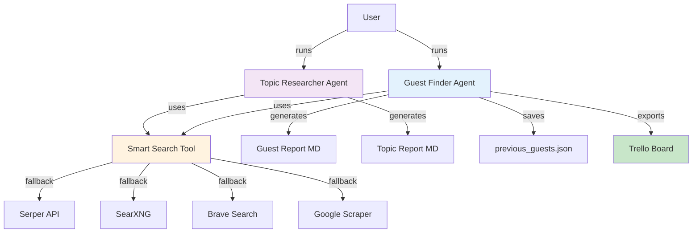
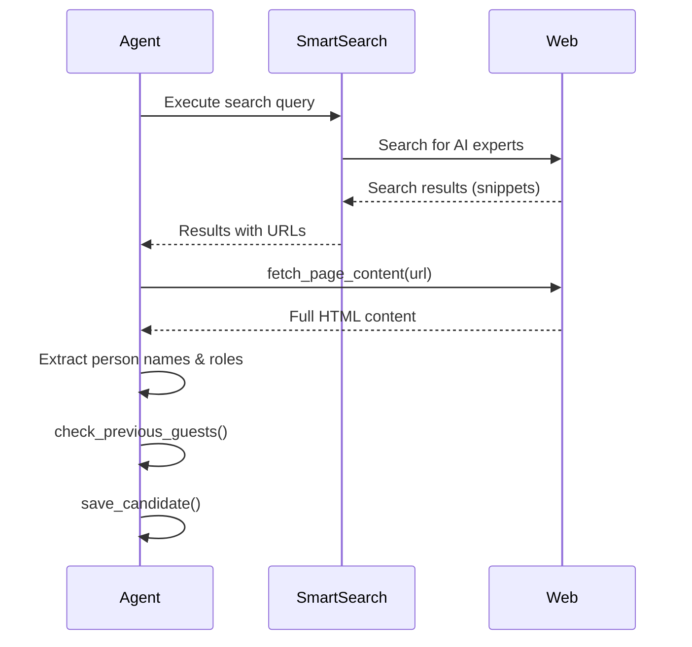
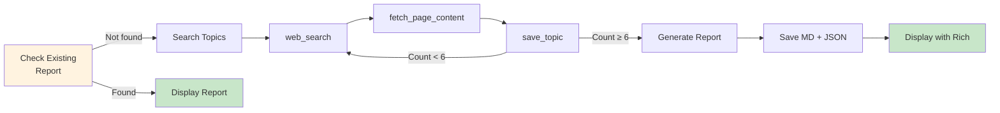
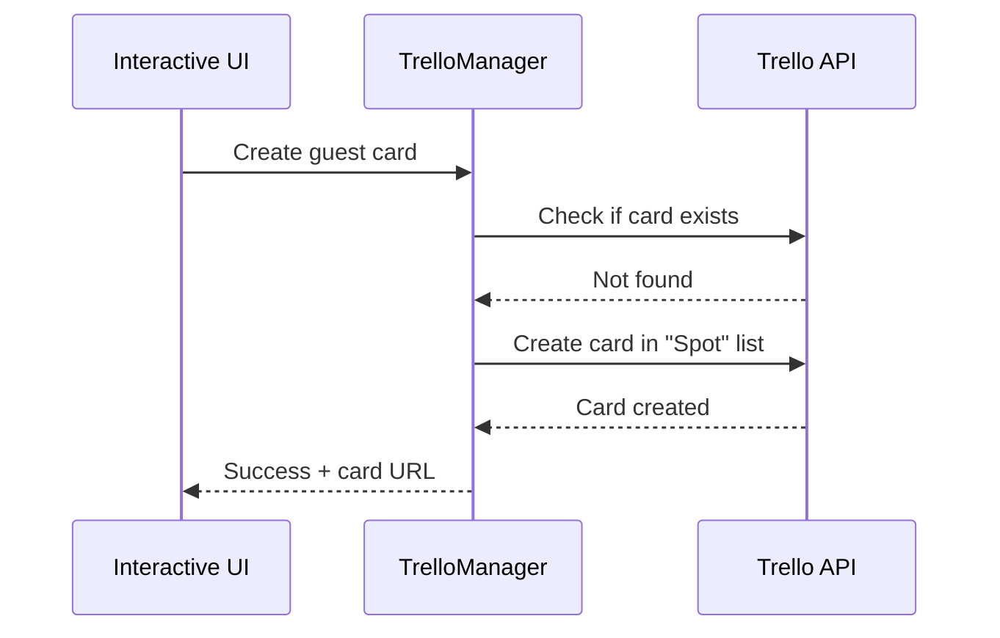
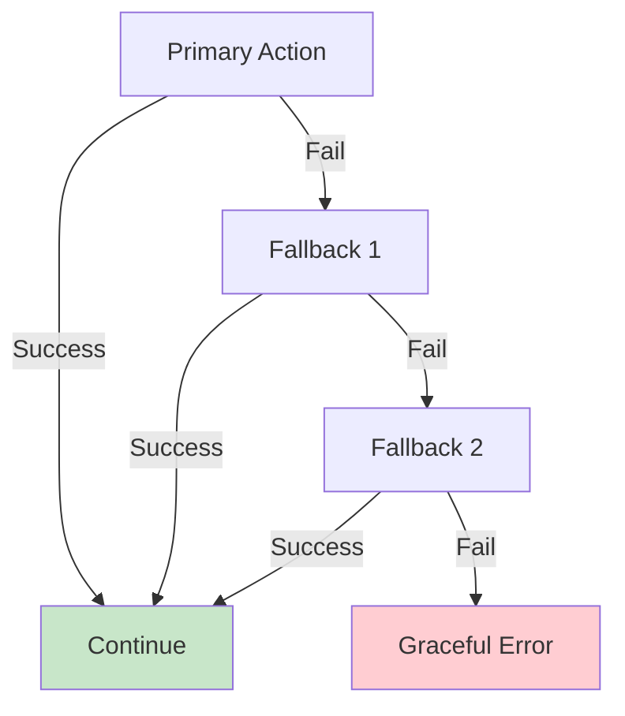

# AI Agent Functionality
## Guest Search & Topic Research

**AIToday Live Podcast**
Intelligent Content Discovery System

---

## Overview

Two specialized AI agents working together:

1. **🔍 Guest Finder Agent** - Finds potential podcast guests
2. **📊 Topic Researcher Agent** - Discovers interesting AI topics

Both powered by **Claude Sonnet 4** with extended thinking

---

## System Architecture



---

## Guest Finder Agent
### Phase 1: Planning

**What it does:**
- Analyzes current AI trends in Netherlands
- Identifies underrepresented sectors
- Creates strategic search queries (8-12)
- Considers recent events and conferences

**Output:** JSON strategy with prioritized queries

---

## Guest Finder Agent
### Phase 2: Search & Analysis



---

## Guest Finder Agent
### Phase 3: Report Generation

**Generates:**
- Markdown report with all candidates
- Recent guests (last 2 weeks) included
- Contact info when available
- Source URLs for verification

**Deduplication:**
- Checks `previous_guests.json`
- Won't recommend same guest within 12 weeks
- Tracks URLs and why_now context

---

## Guest Finder Agent
### Interactive Selection

<div class="columns">

**Features:**
- 🎨 Beautiful Rich terminal UI
- 🔗 Full source URLs displayed
- 📧 Contact info (email/LinkedIn)
- 📋 One-click Trello export
- ✓ Duplicate detection

**Workflow:**
1. Review all candidates
2. Select by number or "all"
3. Export to Trello "Spot" list
4. Cards auto-formatted

</div>

---

## Topic Researcher Agent
### Purpose

**Goal:** Find 6-8 interesting AI topics for podcast

**Target Audience:**
👤 **Anne de Vries**
- IT product owner at mid-size Dutch company
- Early adopter, knows basic AI concepts
- Wants practical application
- Critical thinker, wants what works AND what doesn't

**Time Range:** Last month (not 14 days)

---

## Topic Researcher Agent
### Topic Categories

<div class="columns">

**6 Category Types:**
- 🔬 **Wetenschappelijk** - Research with practical implications
- 💼 **Praktijkvoorbeeld** - Dutch organizations using AI
- 📚 **Informatief** - AI concept/tech explanations
- 🔄 **Transformatie** - Industries being transformed
- ⚠️ **Waarschuwend** - Risks, failures, ethical dilemmas
- 🚀 **Kans** - New opportunities/tools to try

</div>

**Ensures:** Diverse topic coverage per week

---

## Topic Researcher Agent
### Search Flow



---

## Topic Researcher Agent
### Report Content

**Per Topic:**
- Title (max 60 chars)
- Category (one of 6)
- Why relevant for Anne
- Description (2-3 sentences)
- **Search keywords** → use with guest finder!
- Discussion angles (3-4 questions)
- Sources (min 2, preferably Dutch)

**No more:** "Ideal guest profile" (redundant with guest finder)

---

## Topic Researcher Agent
### Duplicate Prevention

**Smart Caching:**
- Reports named: `week_41_20251012.md`
- Checks for today's report before searching
- Shows existing report if found
- Option to force new search (overwrites)

**Benefits:**
- Saves API costs
- Prevents duplicate work
- Consistent daily workflow

---

## Integration: Topics → Guests

**Workflow:**


**Example:**
Topic: "RAG implementation" → Keywords: "RAG, retrieval augmented generation, Dutch"
Guest Search: Finds consultants implementing RAG in Netherlands

---

## Markdown Report Viewing

**Rich Library Integration:**

<div class="columns">

**Features:**
- 📝 Beautiful terminal rendering
- 🎨 Syntax highlighting
- 📋 Formatted headers with borders
- 🔗 Visible URLs
- ➖ Section dividers

**Example:**
```
┏━━━━━━━━━━━━━━━━━━━━━━━━━┓
┃  Report Week 41         ┃
┗━━━━━━━━━━━━━━━━━━━━━━━━━┛

Dr. Sarah Veldman
Senior AI Advisor bij TNO

 • AI Act implementatie
 • Praktische compliance
```

</div>

---

## Smart Search Tool

**Multi-Provider Fallback:**

1. **Serper** (Primary) - Best quality, 2,500/month free
2. **SearXNG** - Free instances, no key needed
3. **Brave Search** - 2,000/month free
4. **Google Scraper** - Fallback, no key

**Features:**
- ⚡ Automatic rate limit detection
- 💾 1-day caching
- 📊 Session tracking of failed providers
- 🔄 Seamless fallback

---

## Trello Integration

**Direct API Implementation:**



**Card Format:**
- Role/function at top (most important)
- Why interesting + context
- Topics, contact info, sources

---

## Testing Coverage

**181 Tests Covering:**

<div class="columns">

**Infrastructure (166 tests):**
- API integration
- Search providers
- File operations
- JSON parsing
- Date logic
- Configuration
- Web scraping
- Trello integration

**Topic Agent (15 tests):**
- Initialization
- Tool definitions
- Tool handling
- Report generation
- Error handling
- Category validation

</div>

**All tests:** ✅ Passing

---

## Configuration

**Environment Variables:**

```bash
# Required
ANTHROPIC_API_KEY=your_key

# Recommended (at least one)
SERPER_API_KEY=your_key
BRAVE_API_KEY=your_key

# Optional (Trello)
TRELLO_API_KEY=your_key
TRELLO_TOKEN=your_token
```

**Configurable Settings:**
- TARGET_CANDIDATES (default: 5)
- EXCLUDE_WEEKS (default: 12)
- MAX_SEARCH_ITERATIONS (default: 10)

---

## Usage: Guest Finder

```bash
# Complete workflow
python main.py
```

**Flow:**
1. Planning Phase → Strategy summary
2. Search Phase → Progress bar with candidate count
3. Report Generation → MD file saved
4. Optional: View report in terminal
5. Interactive Selection → Browse & select guests
6. Trello Export → Create cards in "Spot" list

**Alternative:**
```bash
python select_guests.py  # Skip search, just UI
python demo_ui.py        # UI demo without Trello
```

---

## Usage: Topic Researcher

```bash
# Find topics for podcast
python topic_search.py
```

**Flow:**
1. Check for today's report
2. If exists: Show summary + option to view
3. If not: Run search (6-8 topics, last month)
4. Generate report (MD + JSON)
5. Display with Rich markdown
6. Save to `output/topic_reports/`

**Daily Workflow:**
- Morning: Run topic search
- Review topics and keywords
- Afternoon: Run guest search with those keywords

---

## Key Features Summary

**Guest Finder:**
- ✅ AI-powered strategic planning
- ✅ Multi-provider search fallback
- ✅ Full page content fetching
- ✅ Automatic deduplication (12 weeks)
- ✅ Beautiful terminal UI
- ✅ One-click Trello export
- ✅ 166 tests

**Topic Researcher:**
- ✅ Targets specific persona (Anne)
- ✅ 6 diverse categories
- ✅ Last month (not 14 days)
- ✅ Duplicate prevention
- ✅ Rich markdown rendering
- ✅ JSON + MD output
- ✅ 15 tests

---

## Output Files

**Directory Structure:**

```
output/
├── reports/                    # Guest reports
│   └── week_41_20251012.md
└── topic_reports/              # Topic reports
    ├── week_41_20251012.md
    └── week_41_20251012.json   # Structured data

data/
├── previous_guests.json        # Deduplication DB
└── candidates_latest.json      # Latest search results
```

**All files:** UTF-8 encoded, git-friendly markdown

---

## Performance & Costs

**API Usage:**

<div class="columns">

**Guest Finder:**
- Planning: ~1,000 tokens
- Search: ~20,000 tokens (10 queries)
- Report: ~5,000 tokens
- **Total: ~26,000 tokens/run**

**Topic Researcher:**
- Search: ~15,000 tokens
- Report: ~3,000 tokens
- **Total: ~18,000 tokens/run**
- **Cached:** 0 tokens if same day

</div>

**Costs:** ~$0.50 per full guest+topic cycle

---

## Error Handling

**Robust Fallbacks:**



**Examples:**
- Search provider fails → Try next provider
- Page fetch fails → Skip URL, continue search
- Trello duplicate → Warn user, don't create
- No API key → Clear error message

---

## Future Enhancements

**Potential Features:**
- 🔍 LinkedIn profile search integration
- 📧 Email finder integration
- 🤖 Automated outreach drafts
- 📊 Analytics dashboard
- 🔔 Weekly scheduled runs
- 🌐 Multi-language support
- 📱 Slack/Discord integration
- 🎯 Custom personas beyond Anne

**Contributions welcome!**

---

## Documentation

**Available Docs:**

- 📘 [README.md](../README.md) - Quick start & overview
- 📗 [USAGE.md](USAGE.md) - Complete usage guide
- 📙 [RATE_LIMIT_HANDLING.md](RATE_LIMIT_HANDLING.md) - Search details
- 📕 [TRELLO_SETUP.md](../TRELLO_SETUP.md) - Trello configuration
- 📊 [TEST_COVERAGE_SUMMARY.md](TEST_COVERAGE_SUMMARY.md) - Test details
- 🏗️ [architecture.md](architecture.md) - Arc42 documentation

**All docs:** Maintained and up-to-date

---

## Tech Stack

<div class="columns">

**Core:**
- Python 3.10+
- Anthropic Claude Sonnet 4
- Rich (Terminal UI)
- BeautifulSoup4 (HTML parsing)
- Requests (HTTP)

**Testing:**
- Pytest (181 tests)
- Unittest.mock
- Pytest-cov

</div>

<div class="columns">

**Search:**
- Serper API
- SearXNG
- Brave Search API
- Google Scraper

**Tools:**
- Ruff (formatting & linting)
- Mypy (type checking)
- Git (version control)
- VSCode (recommended IDE)

</div>

---

## Best Practices

**Workflow Recommendations:**

1. **Daily:** Run topic search in morning
2. **Review:** Check topics and keywords
3. **Search:** Run guest finder with topic keywords
4. **Select:** Use interactive UI to review guests
5. **Export:** Send to Trello "Spot" list
6. **Weekly:** Clean up Trello board (Spot → Contacted)

**Tips:**
- Let cache work (don't run topic search twice/day)
- Verify URLs before reaching out
- Update previous_guests.json manually if needed
- Keep API keys secure in .env

---

# Demo Time! 🎬

**Let's see it in action:**

1. Topic Search
2. Guest Finder
3. Interactive Selection
4. Trello Export
5. Markdown Report

---

# Questions? 💬

**Repository:** https://github.com/Joopsnijder/guest_search

**License:** MIT

**Built with:** [Claude Code](https://claude.com/claude-code) by Anthropic

---

# Thank You! 🎉

**Happy Guest Hunting!** 🔍🎙️
