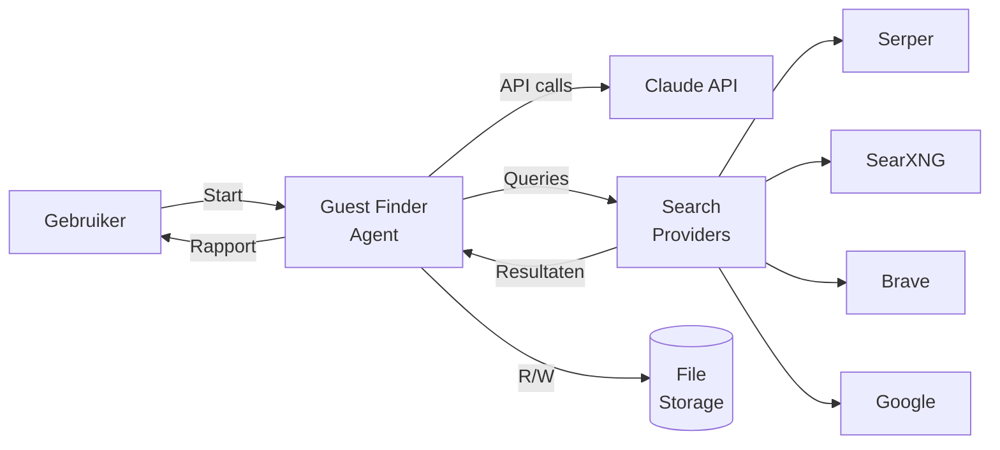
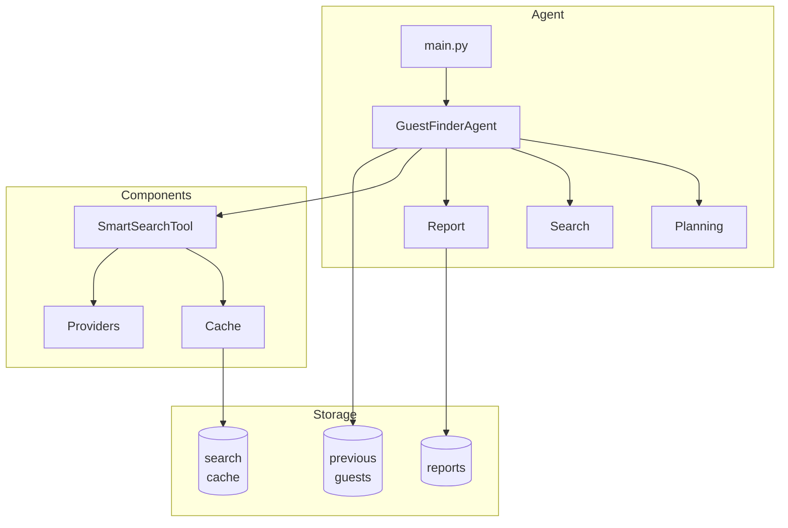
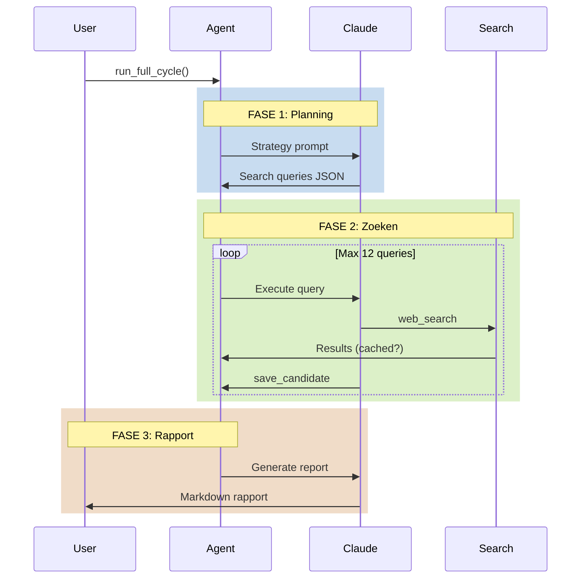
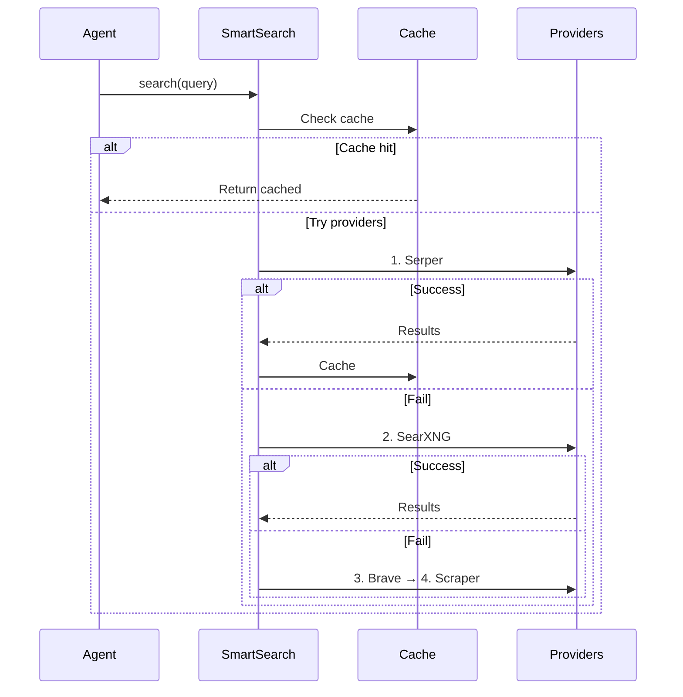
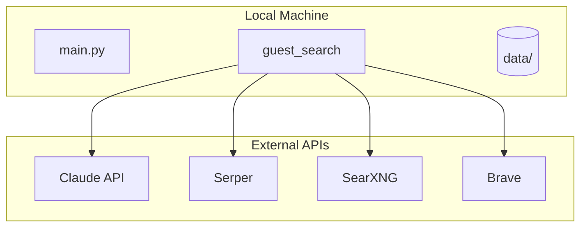

# Guest Search - Architectuur

**AI-driven podcast guest finder**

arc42 documentatie

---

## 1. Introductie

### Doel
Geautomatiseerde wekelijkse zoektocht naar Nederlandse AI-experts voor AIToday Live podcast

### Stakeholders
- 🎙️ Podcast producers → Actuele gastenlijst
- ✍️ Redactie → Geverifieerde kandidaten
- 👥 Eindgebruikers → Betrouwbare voorstellen

---

## 2. Context

---

## 3. Oplossingstrategie

### Kernprincipes
1. 🎯 **Multi-phase**: Planning → Zoeken → Rapporteren
2. 🧠 **AI-driven**: Claude met extended thinking
3. 🔄 **Resilient search**: Multi-provider fallback
4. 💾 **Caching**: 1-dag cache voor rate limits
5. ✅ **Verificatie**: Min. 2 bronnen per kandidaat

---

## 4. Building Blocks

---

## 5. Runtime: Volledige Cyclus

---

## 6. Smart Search Fallback

---

## 7. Deployment

**Deployment**: Python app met lokale storage

---

## 8. Architectuurbeslissingen

### ADR-001: Multi-Phase Design
✅ Scheiding planning/zoeken/rapporteren
✅ Extended thinking voor strategie

### ADR-002: Smart Search Fallback
✅ Geen vendor lock-in
✅ Resilience tegen rate limits

### ADR-003: File-based Storage
✅ Simpel, geen database overhead
✅ Git-friendly

---

## 9. Kwaliteitseisen

| Kwaliteit | Target | Status |
|-----------|--------|--------|
| **Test Coverage** | >80% | ✅ 148 tests |
| **Availability** | >95% | ✅ Multi-provider |
| **Response Time** | <2 min | ✅ Met cache |
| **Accuracy** | 2+ bronnen | ✅ Verplicht |
| **Freshness** | <14 dagen | ✅ Recent focus |

---

## 10. Component Overzicht

| Component | Verantwoordelijkheid |
|-----------|---------------------|
| **GuestFinderAgent** | Orkestratie 3 fases |
| **SmartSearchTool** | Multi-provider search |
| **SearchResultCache** | 1-dag caching |
| **SearchProviders** | API abstractie |
| **Tools** | Agent capabilities |
| **Prompts** | Fase-specifieke prompts |

---

## 11. Risico's & Mitigaties

### Risico's
1. ⚠️ **Rate Limits** → Multi-provider + caching
2. ⚠️ **API Changes** → Tests detecteren dit
3. ⚠️ **Search Quality** → Scraper als fallback

### Technische Schuld
- 🔄 Async support voor parallelle queries
- 📊 Database voor team usage
- 🔔 Monitoring/alerting

---

## Samenvatting

### Architectuur Highlights
- 🎯 3-fase AI agent (planning/search/report)
- 🔄 Resilient multi-provider search
- 💾 Smart caching strategie
- ✅ 148 tests, 8 risk areas
- 📦 Simpel file-based storage

### Stack
Python 3.10+ | Claude Sonnet 4 | Serper/SearXNG/Brave/Scraper

---

# Vragen?

📖 Volledige documentatie: `docs/architecture.md`
🧪 Tests: `pytest`
🔧 Config: `.env` + `config.py`
