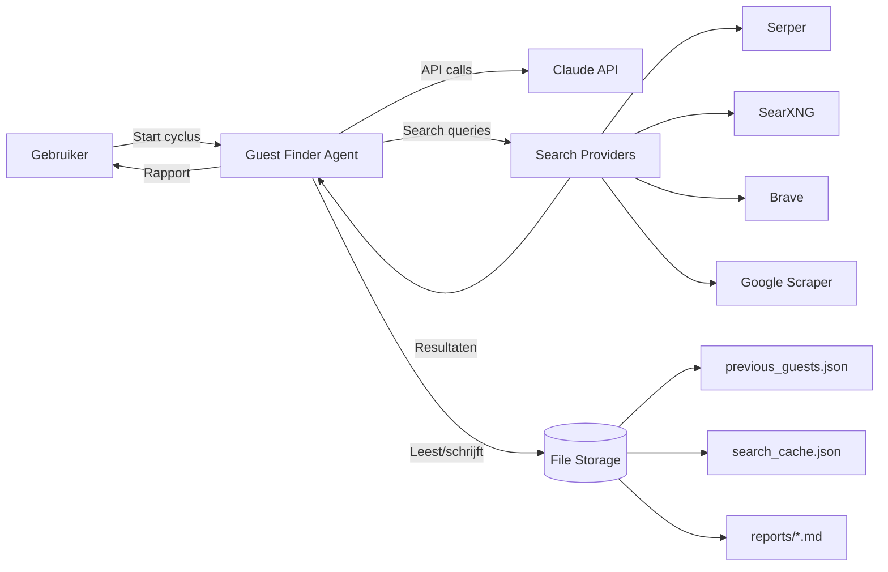
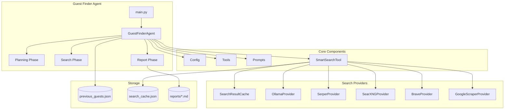
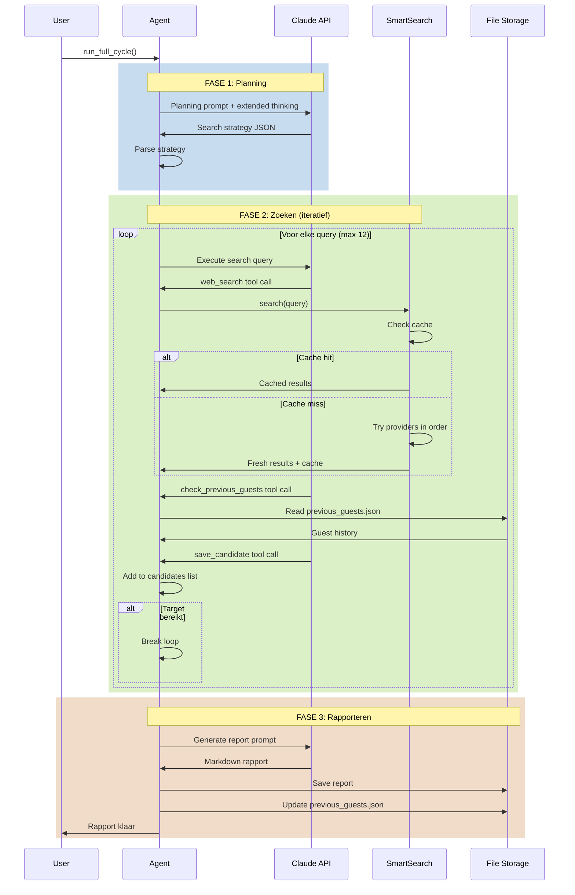
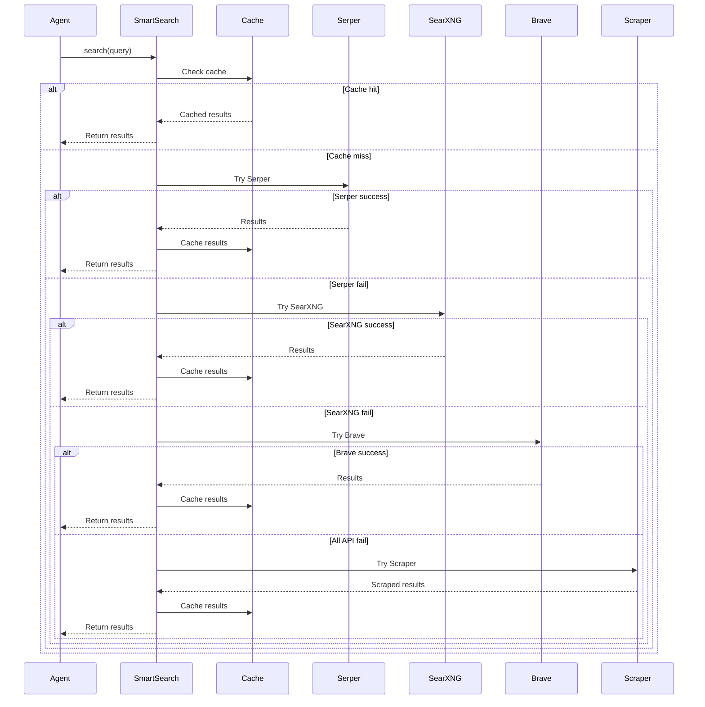
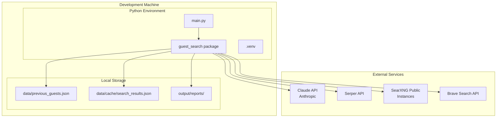

# Guest Search - Architectuur Documentatie (arc42)

## 1. Introductie en Doelen

### 1.1 Doel van het Systeem
Een geautomatiseerde AI-agent die wekelijks zoekt naar relevante Nederlandse AI-experts als potentiële gasten voor de podcast AIToday Live.

### 1.2 Stakeholders

| Stakeholder | Verwachtingen |
|------------|---------------|
| Podcast producers | Wekelijks actuele gastenlijst met diverse AI-experts |
| Redactie | Geverifieerde kandidaten met meerdere bronnen |
| Eindgebruikers | Betrouwbare en relevante gastvoorstellen |

## 2. Randvoorwaarden

### 2.1 Technische Randvoorwaarden
- Python 3.10+
- Claude Sonnet 4 API (Anthropic)
- Multiple search providers (Serper/SearXNG/Brave/Google scraper)
- Lokale file-based storage

### 2.2 Organisatorische Randvoorwaarden
- Wekelijkse uitvoering
- Exclusie window: 8 weken
- Target: 8 kandidaten per week
- Nederlandse focus

## 3. Context en Scope

## 4. Oplossingstrategie

### 4.1 Kernprincipes
1. **Multi-phase approach**: Planning → Zoeken → Rapporteren
2. **AI-driven**: Claude agent met extended thinking voor strategische beslissingen
3. **Search resilience**: Automatic fallback tussen meerdere search providers
4. **Caching**: 1-dag cache om rate limits te beheersen
5. **Verificatie**: Minimaal 2 bronnen per kandidaat

### 4.2 Technologie Keuzes
- **Anthropic Claude**: Extended thinking voor planning en strategie
- **Smart Search Tool**: Multi-provider fallback systeem
- **File-based storage**: Simpel, geen database overhead

## 5. Bouwstenen (Building Blocks)

### 5.1 Component Beschrijvingen

| Component | Verantwoordelijkheid |
|-----------|---------------------|
| **GuestFinderAgent** | Orkestreert de 3 fases, beheert conversatie met Claude |
| **SmartSearchTool** | Intelligente search met automatic fallback |
| **SearchResultCache** | 1-dag caching van zoekresultaten |
| **SearchProviders** | Abstractie laag voor verschillende search APIs |
| **Tools** | Agent tool definitions (web_search, check_previous_guests, save_candidate) |
| **Prompts** | Gestructureerde prompts voor elke fase |
| **Config** | Centrale configuratie (API keys, thresholds) |

## 6. Runtime View

### 6.1 Volledige Cyclus

### 6.2 Smart Search Fallback

## 7. Deployment View

## 8. Crosscutting Concepts

### 8.1 Caching Strategie
- **Doel**: Rate limit beheersing en snellere tests
- **Duur**: 1 dag
- **Scope**: Query + provider agnostic
- **Location**: `data/cache/search_results.json`

### 8.2 Error Handling
- **Search fallback**: Automatisch naar volgende provider
- **SearXNG rotation**: Dynamic instance rotation bij failures
- **Graceful degradation**: Werkt door met minder resultaten

### 8.3 Configuratie
- **Centraal**: `config.py`
- **Environment**: API keys via `.env`
- **Versioned**: Thresholds en parameters in code

### 8.4 Testing
- **148 tests** over 8 risk areas
- **Mocking**: Responses library voor API calls
- **Freezegun**: Tijd-gerelateerde tests
- **Fixtures**: Herbruikbare test data

## 9. Architectuurbeslissingen

### ADR-001: Multi-Phase Agent Design
**Context**: Complex taak met verschillende cognitieve eisen

**Besluit**: Splits in 3 fases (planning, zoeken, rapporteren)

**Rationale**:
- Planning fase kan extended thinking gebruiken
- Zoek fase is iteratief en tool-heavy
- Rapport fase is output-focused

**Consequenties**: ✅ Duidelijke separation of concerns, ❌ Meer code complexity

### ADR-002: Smart Search met Fallback
**Context**: Rate limits en reliability issues bij search providers

**Besluit**: Multi-provider systeem met automatische fallback

**Rationale**:
- Geen vendor lock-in
- Resilience tegen rate limits
- Cost optimization (gratis tiers eerst)

**Consequenties**: ✅ High availability, ❌ Meer configuratie

### ADR-003: File-based Storage
**Context**: Simpele data persistence nodig

**Besluit**: JSON files in plaats van database

**Rationale**:
- Geen database overhead
- Makkelijk te inspecteren
- Git-friendly voor backups

**Consequenties**: ✅ Simpel, ✅ Geen setup, ❌ Geen concurrent access

### ADR-004: 1-Day Search Cache
**Context**: Herhaalde queries tijdens development/testing

**Besluit**: 1-dag cache voor search resultaten

**Rationale**:
- Rate limit bescherming
- Snellere tests
- Actueel genoeg voor gebruik

**Consequenties**: ✅ Sneller en goedkoper, ❌ Mogelijk verouderde data

## 10. Kwaliteitseisen

| Kwaliteit | Target | Huidige Status |
|-----------|--------|----------------|
| **Test Coverage** | >80% | ✅ 148 tests, 8 risk areas |
| **Availability** | >95% | ✅ Multi-provider fallback |
| **Response Time** | <2 min per query | ✅ Met caching |
| **Accuracy** | 2+ bronnen per kandidaat | ✅ Verificatie verplicht |
| **Freshness** | Max 14 dagen oud | ✅ Recent search focus |

## 11. Risico's en Technische Schuld

### Risico's
1. **Rate Limits**: Mitigatie via multi-provider + caching
2. **API Changes**: Providers kunnen API wijzigen → Tests detecteren dit
3. **Search Quality**: Google scraper kan breken → Niet primary provider

### Technische Schuld
1. **Async Support**: SmartSearch kan async worden voor parallelle queries
2. **Database**: Bij schaling naar team usage
3. **Monitoring**: Nog geen alerting op failures

## 12. Glossary

| Term | Definitie |
|------|-----------|
| **Agent** | Claude AI die autonome beslissingen neemt |
| **Tool** | Functie die agent kan aanroepen (web_search, etc.) |
| **Provider** | Externe search service (Serper, SearXNG, etc.) |
| **Extended Thinking** | Claude feature voor diep nadenken met thinking budget |
| **Candidate** | Potentiële podcast gast met verificatie |
| **Strategy** | JSON output van planning fase met queries |
