# Guest Search - Architectuur Documentatie (arc42)

## 1. Introductie en Doelen

### 1.1 Doel van het Systeem
Een geautomatiseerde AI-agent die wekelijks zoekt naar relevante Nederlandse AI-experts als potentiële gasten voor de podcast AIToday Live.

### 1.2 Stakeholders

| Stakeholder | Verwachtingen |
|------------|---------------|
| Podcast producers | Wekelijks actuele gastenlijst met diverse AI-experts |
| Redactie | Geverifieerde kandidaten met meerdere bronnen |
| Eindgebruikers | Betrouwbare en relevante gastvoorstellen |

## 2. Randvoorwaarden

### 2.1 Technische Randvoorwaarden
- Python 3.10+
- Claude Sonnet 4 API (Anthropic)
- Portkey AI Gateway (optioneel - voor observability)
- Multiple search providers (Serper/SearXNG/Brave/Google scraper)
- Lokale file-based storage

### 2.2 Organisatorische Randvoorwaarden
- Wekelijkse uitvoering
- Exclusie window: 8 weken
- Target: 8 kandidaten per week
- Nederlandse focus

## 3. Context en Scope


## 4. Oplossingstrategie

### 4.1 Kernprincipes
1. **Multi-phase approach**: Planning → Zoeken → Rapporteren
2. **AI-driven**: Claude agent met extended thinking voor strategische beslissingen
3. **Learning system**: Agent leert van eerdere zoeksessies om strategie te verbeteren
4. **Prompt caching**: 70-80% kostenreductie via Anthropic prompt caching (search phase)
5. **Search resilience**: Automatic fallback tussen meerdere search providers
6. **Search result caching**: 1-dag cache om rate limits te beheersen
7. **Verificatie**: Minimaal 2 bronnen per kandidaat

### 4.2 Technologie Keuzes
- **Anthropic Claude**: Extended thinking voor planning en strategie
- **Portkey AI Gateway**: Optionele observability laag voor monitoring en cost tracking
- **Smart Search Tool**: Multi-provider fallback systeem
- **File-based storage**: Simpel, geen database overhead

## 5. Bouwstenen (Building Blocks)


### 5.1 Component Beschrijvingen

| Component | Verantwoordelijkheid |
|-----------|---------------------|
| **GuestFinderAgent** | Orkestreert de 3 fases, beheert conversatie met Claude |
| **PortkeyClient** | Adapter voor Anthropic SDK met optionele Portkey observability |
| **SmartSearchTool** | Intelligente search met automatic fallback |
| **SearchResultCache** | 1-dag caching van zoekresultaten |
| **SearchProviders** | Abstractie laag voor verschillende search APIs |
| **Learning System** | Tracked query performance en genereert insights voor verbetering |
| **Tools** | Agent tool definitions (web_search, check_previous_guests, save_candidate) |
| **Prompts** | Gestructureerde prompts voor elke fase (inclusief learning insights) |
| **Config** | Centrale configuratie (API keys, thresholds) |

## 6. Runtime View

### 6.1 Portkey Observability Layer (Optioneel)

```mermaid
sequenceDiagram
    participant A as Agent
    participant PA as PortkeyAdapter
    participant PG as Portkey Gateway
    participant C as Claude API
    participant PD as Portkey Dashboard

    A->>PA: messages.create() [Anthropic format]
    Note over PA: Convert Anthropic → OpenAI format
    PA->>PG: chat.completions.create() [OpenAI format]
    PG->>PD: Log request metadata
    Note over PG: Route to provider
    PG->>C: messages API call
    C->>PG: Response
    PG->>PD: Log response + tokens + cost
    Note over PA: Convert OpenAI → Anthropic format
    PA->>A: Message response [Anthropic format]
```



**Adapter Werking:**

- Agent code blijft ongewijzigd (Anthropic SDK)
- Adapter converteert formats transparant
- Portkey logt alle metrics automatisch
- Fallback naar direct Anthropic als Portkey niet geconfigureerd

### 6.2 Volledige Cyclus


### 6.2 Smart Search Fallback


### 6.3 Learning System Flow


**Learning Cycle:**

1. **Planning gebruikt insights**: Agent ziet welke queries/bronnen eerder succesvol waren
2. **Search tracked performance**: Elke query registreert resultaten en bronnen
3. **Report bewaart sessie**: Alle performance data wordt opgeslagen voor toekomstige runs
4. **Verbetering over tijd**: Elke volgende run is beter geïnformeerd

### 6.4 Prompt Caching Flow


**Prompt Caching Strategie:**

1. **Wat wordt gecached**: Statische zoek-instructies (~1500 tokens)
   - Workflow stappen (web_search → fetch_page_content → save_candidate)
   - Voorbeelden van correcte uitvoering
   - Alle regels en richtlijnen

2. **Wat is dynamic**: Query-specifieke informatie (~200 tokens)
   - Huidige voortgang (query 3/12, 2 kandidaten gevonden)
   - Actuele zoekopdracht en rationale

3. **Cache characteristics**:
   - TTL: 5 minuten (Anthropic default)
   - Trigger: `cache_control: {"type": "ephemeral"}` marker
   - Minimum: 1024 tokens (we gebruiken ~1500)
   - Reuse: Automatisch bij identical content

4. **Cost impact**:
   - **Zonder caching**: 12 queries × 1500 tokens = 18,000 input tokens
   - **Met caching**: 1 × 1500 (create) + 11 × ~150 (reads) = ~3,150 tokens
   - **Besparing**: ~82% op zoek fase prompts

5. **Configuratie**:
   ```python
   # Config.py
   ENABLE_PROMPT_CACHING = True  # Default enabled

   # Disable via .env
   ENABLE_PROMPT_CACHING=false
   ```

### 6.5 Content Enrichment Flow


**Content Enrichment Strategie:**

1. **Waarom enrichment?**
   - Search phase levert basic data: generieke topics, korte relevance
   - Report needs detail: specifieke onderwerpen, uitgebreide context
   - Trello needs context: rijk content voor decision making
   - **Oplossing**: Enrich tijdens report generation, save terug naar candidates

2. **Enrichment proces**:
   ```python
   # Before (from search phase):
   {
     "topics": ["AI", "regelgeving"],
     "relevance_description": "Expert op gebied van AI wetgeving"
   }

   # After (from report generation):
   {
     "topics": [
       "Praktische implementatie van de EU AI Act in Nederland",
       "Privacy- en databeschermingsregels voor AI-systemen",
       "Juridische risico's van generative AI"
     ],
     "relevance_description": "Professor Global ICT Law aan Tilburg University met focus op praktische toepassing van nieuwe AI wetgeving. Haar expertise ligt op het snijvlak van juridische compliance en ethische AI-ontwikkeling. Ze spreekt regelmatig op conferenties over implementatie-uitdagingen."
   }
   ```

3. **Tool definition**:
   ```python
   {
     "name": "enrich_candidate",
     "input_schema": {
       "name": "string",  # Match exactly
       "enriched_topics": ["array of 4-5 specific topics"],
       "enriched_relevance": "3-5 sentence detailed description"
     }
   }
   ```

4. **Flow details**:
   - Agent gets candidates JSON in prompt
   - Agent calls `enrich_candidate` for each (8× tool calls)
   - Agent updates `self.candidates` in-place
   - Agent generates markdown using enriched data
   - Enriched data flows: candidates_latest.json → Trello cards

5. **Benefits**:
   - Single source of truth voor enriched content
   - Trello cards have same detail as reports
   - No manual copying/pasting
   - Consistent data across all outputs

### 6.6 LinkedIn Profile Enrichment

**Strategie:**

Na het vinden van kandidaten (Fase 2), maar vóór rapport generatie (Fase 3), zoekt het systeem automatisch LinkedIn profielen voor alle kandidaten.

**Werkwijze:**

1. **Voor elke kandidaat**:
   ```python
   query = f'"{name}" {organization} LinkedIn'
   results = self.smart_search.search(query, num_results=5)
   ```

2. **URL extractie**:
   - Loop door search results
   - Find first URL containing `linkedin.com/in/`
   - Check beide `link` en `url` keys (provider compatibility)

3. **Data update**:
   ```python
   if linkedin_url:
       candidate["contact_info"]["linkedin"] = linkedin_url
   ```

4. **Error handling**:
   - Silent fail: LinkedIn is nice-to-have, not critical
   - Shows warning only in DEBUG_TOOLS mode
   - Continues with other candidates if one fails

**Output:**

```
╭─────────────────────────────────────────╮
│ 🔗 LINKEDIN ENRICHMENT                  │
│ Zoek LinkedIn profielen voor kandidaten │
╰─────────────────────────────────────────╯
✓ LinkedIn gevonden: Lokke Moerel
✓ LinkedIn gevonden: Maarten Stolk
╭───── LinkedIn Enrichment Voltooid ──────╮
│  ✓  LinkedIn profielen  2/2              │
╰─────────────────────────────────────────╯
```

**Trello Integration:**

LinkedIn links verschijnen bovenaan Trello kaarten in Contact sectie:

```
CEO bij Deeploy

Contact:
- LinkedIn: https://nl.linkedin.com/in/mjwstolk

Waarom interessant:
[...]
```

**Benefits:**
- 🎯 **One-click contact** - Production team kan direct contact leggen
- ⚡ **Automatic** - Geen handmatig zoekwerk nodig
- 🔄 **Reliable** - Gebruikt bestaande SmartSearch infrastructure
- 📋 **Well-integrated** - LinkedIn verschijnt in alle outputs (JSON + Trello)

## 7. Deployment View


## 8. Crosscutting Concepts

### 8.1 Caching Strategie

Het systeem gebruikt twee soorten caching:

**A. Prompt Caching (Anthropic)**
- **Doel**: 70-80% kostenreductie op herhaalde API calls
- **Scope**: Statische prompt instructies in search phase
- **Duur**: 5 minuten TTL (per Anthropic session)
- **Mechanisme**: `cache_control: {"type": "ephemeral"}` marker
- **Impact**: ~82% besparing op input tokens (18K → 3K)
- **Configuratie**: `ENABLE_PROMPT_CACHING=true` (default)

**B. Search Result Caching (Local)**
- **Doel**: Rate limit beheersing en snellere tests
- **Duur**: 1 dag
- **Scope**: Query + provider agnostic
- **Location**: `data/cache/search_results.json`

### 8.2 Error Handling
- **Search fallback**: Automatisch naar volgende provider
- **SearXNG rotation**: Dynamic instance rotation bij failures
- **Graceful degradation**: Werkt door met minder resultaten

### 8.3 Configuratie
- **Centraal**: `config.py`
- **Environment**: API keys via `.env`
- **Versioned**: Thresholds en parameters in code

### 8.4 Testing

- **187 tests** over 11 risk areas (incl. Portkey adapter en learning system)
- **Mocking**: Responses library voor API calls
- **Freezegun**: Tijd-gerelateerde tests
- **Fixtures**: Herbruikbare test data

### 8.5 Observability (Optioneel)

- **Portkey Dashboard**: Real-time monitoring van API calls
- **Metrics**: Token usage, costs, latency, error rates
- **Adapter Pattern**: Transparante integratie zonder code wijzigingen
- **Backwards Compatible**: Werkt met/zonder Portkey configuratie

## 9. Architectuurbeslissingen

### ADR-001: Multi-Phase Agent Design
**Context**: Complex taak met verschillende cognitieve eisen

**Besluit**: Splits in 3 fases (planning, zoeken, rapporteren)

**Rationale**:
- Planning fase kan extended thinking gebruiken
- Zoek fase is iteratief en tool-heavy
- Rapport fase is output-focused

**Consequenties**: ✅ Duidelijke separation of concerns, ❌ Meer code complexity

### ADR-002: Smart Search met Fallback
**Context**: Rate limits en reliability issues bij search providers

**Besluit**: Multi-provider systeem met automatische fallback

**Rationale**:
- Geen vendor lock-in
- Resilience tegen rate limits
- Cost optimization (gratis tiers eerst)

**Consequenties**: ✅ High availability, ❌ Meer configuratie

### ADR-003: File-based Storage
**Context**: Simpele data persistence nodig

**Besluit**: JSON files in plaats van database

**Rationale**:
- Geen database overhead
- Makkelijk te inspecteren
- Git-friendly voor backups

**Consequenties**: ✅ Simpel, ✅ Geen setup, ❌ Geen concurrent access

### ADR-004: 1-Day Search Cache
**Context**: Herhaalde queries tijdens development/testing

**Besluit**: 1-dag cache voor search resultaten

**Rationale**:
- Rate limit bescherming
- Snellere tests
- Actueel genoeg voor gebruik

**Consequenties**: ✅ Sneller en goedkoper, ❌ Mogelijk verouderde data

### ADR-005: Portkey Observability via Adapter Pattern

**Context**: Behoefte aan monitoring van API usage, costs en performance zonder bestaande code te wijzigen

**Besluit**: Implementeer Portkey via adapter pattern die Anthropic SDK interface behoudt

**Rationale**:

- **Portkey Model Catalog** vereist OpenAI format, maar onze agents gebruiken Anthropic format
- **Adapter pattern** converteert formats transparant zonder code wijzigingen
- **Backwards compatible**: Werkt met/zonder Portkey configuratie
- **Optional feature**: Toggle via environment variables

**Alternatieven overwogen**:

1. ❌ Hele codebase herschrijven naar OpenAI format → Te veel werk, niet backwards compatible
2. ❌ Direct Anthropic SDK met custom base_url → Werkt niet met nieuwe Model Catalog
3. ✅ Adapter pattern → Zero code changes, optioneel, backwards compatible

**Conversies die de adapter doet**:

- Message content blocks: Anthropic `[{type: "text", text: "..."}]` → OpenAI `"..."`
- Tool definitions: `input_schema` → `parameters`
- Tool results: `tool_result` role → `tool` role
- Empty content filtering voor OpenAI compliance

**Consequenties**:

- ✅ Zero wijzigingen aan agent code
- ✅ Real-time monitoring van costs en performance
- ✅ Kan eenvoudig uitgeschakeld worden
- ❌ Extra conversie laag (minimale performance impact)
- ❌ Afhankelijkheid van portkey-ai package (optioneel)

**Implementatie**: `src/utils/portkey_client.py` met 157 tests

### ADR-006: Query Performance Learning System

**Context**: Agent maakt elke week opnieuw een zoekstrategie zonder te leren van eerdere resultaten

**Besluit**: Implementeer automatisch learning systeem dat query performance tracked en gebruikt voor toekomstige strategieën

**Rationale**:
- **Efficiency**: Agent verspilt tijd aan queries die niet werken
- **Improvement**: Systeem wordt beter over tijd zonder handmatige interventie
- **Transparency**: Alle data is inzichtelijk in JSON format
- **No AI training needed**: Gebruikt simpele metrics (query → candidates count)

**Alternatieven overwogen**:
1. ❌ Manual tuning van prompts → Te arbeidsintensief, niet schaalbaar
2. ❌ RAG met embeddings → Overkill voor simpele performance metrics
3. ✅ File-based query tracking → Simple, transparent, effective

**Implementatie details**:
- Track per query: text, candidates found, successful sources, timestamp
- Analyze laatste 4 weken voor insights
- Inject insights in planning prompt
- Agent ziet top queries, best sources, averages
- Zero manual intervention needed

**Consequenties**:
- ✅ Agent verbetert automatisch over tijd
- ✅ Transparante learning (geen black box)
- ✅ Minimal code complexity (200 LOC)
- ✅ Well tested (6 new unit tests)
- ❌ Eerste run heeft geen insights (cold start)
- ❌ Extra storage file (search_history.json)

**Toekomstige uitbreidingen mogelijk**:
- Level 2: Agent reflecties (semantic learning)
- Level 3: Real-time strategy adaptation
- Level 4: Cross-session pattern recognition

**Implementatie**: Learning methods in `GuestFinderAgent`, documentatie in `docs/LEARNING_SYSTEM.md`

### ADR-007: Anthropic Prompt Caching

**Context**: Search phase voert 8-12 queries uit, elk met dezelfde ~1500 token instructies, resulterend in hoge input token costs

**Besluit**: Implementeer Anthropic prompt caching door search prompt te splitsen in cacheable (static) en dynamic (per-query) delen

**Rationale**:
- **Cost reduction**: 70-80% besparing op search phase input tokens
- **Speed improvement**: 10-20% sneller door cache reads vs volledige processing
- **Simple implementation**: Minimale code wijzigingen, backwards compatible
- **Anthropic native**: Gebruikt officiële Anthropic caching feature (ephemeral)

**Alternatieven overwogen**:
1. ❌ Kortere prompts → Vermindert effectiviteit, agent mist kritieke context
2. ❌ Single API call met alle queries → Verliest multi-turn conversatie context
3. ❌ Custom caching laag → Meer complex, geen cost benefit
4. ✅ Anthropic prompt caching → Native support, proven ROI

**Implementatie details**:
- Gesplitste prompts: `SEARCH_EXECUTION_PROMPT_CACHEABLE` (~1500 tokens) + `SEARCH_EXECUTION_PROMPT_DYNAMIC` (~200 tokens)
- Cache marker: `cache_control: {"type": "ephemeral"}` op cacheable block
- TTL: 5 minuten (Anthropic default, perfect voor typische sessie lengte)
- Portkey doorvoer: Cache control wordt doorgegeven via extra_headers
- Config: `ENABLE_PROMPT_CACHING=true` (default, kan disabled worden)

**Consequenties**:
- ✅ ~82% cost reduction: 18K tokens → 3K tokens (per 12-query session)
- ✅ Snellere response tijd door cache hits
- ✅ Zero functionaliteit wijziging (zelfde output)
- ✅ Backwards compatible (fallback naar combined prompt)
- ❌ Afhankelijk van Anthropic cache (vendor lock-in)
- ❌ 5 min TTL kan expiren bij zeer lange sessies (acceptabel)
- ⚠️ Minimum 1024 tokens vereist (we gebruiken 1500+)

**Cost voorbeeld (Claude Sonnet 4)**:
```
Zonder caching:
- 12 queries × 1500 tokens = 18,000 input tokens
- @ $3/MTok = $0.054 per sessie

Met caching:
- Query 1: 1500 create tokens @ $3.75/MTok = $0.00563
- Query 2-12: 11 × 150 read tokens @ $0.30/MTok = $0.00050
- Totaal: $0.00613 per sessie

Besparing: $0.048 per sessie (88% reductie)
```

**Implementatie**: Prompt split in `prompts.py`, cache logic in `agent.py`, Portkey support in `portkey_client.py`

## 10. Kwaliteitseisen

| Kwaliteit | Target | Huidige Status |
|-----------|--------|----------------|
| **Test Coverage** | >80% | ✅ 187 tests, 11 risk areas |
| **Availability** | >95% | ✅ Multi-provider fallback |
| **Response Time** | <2 min per query | ✅ Met caching |
| **Accuracy** | 2+ bronnen per kandidaat | ✅ Verificatie verplicht |
| **Freshness** | Max 14 dagen oud | ✅ Recent search focus |
| **Observability** | Real-time monitoring | ✅ Optioneel via Portkey |

## 11. Risico's en Technische Schuld

### Risico's
1. **Rate Limits**: Mitigatie via multi-provider + caching
2. **API Changes**: Providers kunnen API wijzigen → Tests detecteren dit
3. **Search Quality**: Google scraper kan breken → Niet primary provider

### Technische Schuld

1. **Async Support**: SmartSearch kan async worden voor parallelle queries
2. **Database**: Bij schaling naar team usage
3. **Portkey Alerting**: Dashboard heeft metrics maar nog geen automated alerting

## 12. Glossary

| Term | Definitie |
|------|-----------|
| **Agent** | Claude AI die autonome beslissingen neemt |
| **Tool** | Functie die agent kan aanroepen (web_search, etc.) |
| **Provider** | Externe search service (Serper, SearXNG, etc.) |
| **Extended Thinking** | Claude feature voor diep nadenken met thinking budget |
| **Candidate** | Potentiële podcast gast met verificatie |
| **Strategy** | JSON output van planning fase met queries |
| **Adapter** | Wrapper pattern voor format conversie tussen APIs |
| **Portkey** | AI Gateway voor observability en monitoring |
| **Model Catalog** | Portkey's gecentraliseerde provider management systeem |
