# 🔍 Guest Finder Agent
## AI-Powered Podcast Guest Discovery

**AIToday Live Podcast**
Intelligent Guest Search & Management

---

## What is the Guest Finder Agent?

**Purpose:**
Find potential Dutch AI podcast guests automatically

**Powered by:**
- Claude Sonnet 4 with extended thinking
- Multi-provider web search
- Smart deduplication system

**Output:**
- Curated guest list with context
- One-click Trello export
- Source verification

---

## System Architecture


---

## How It Works: 3 Phases

<div class="columns">

**Phase 1: Planning** 🧠
- Analyze current AI trends in NL
- Identify underrepresented sectors
- Create strategic search queries (8-12)
- Consider recent events

**Phase 2: Search & Analysis** 🔍
- Execute multi-provider search
- Fetch full page content
- Extract person names & roles
- Check deduplication

</div>

**Phase 2.5: LinkedIn Enrichment** 🔗
- Auto-search LinkedIn profiles
- Extract linkedin.com/in/ URLs
- Add to contact info

**Phase 3: Report & Export** 📋
- **Content enrichment**
- Generate markdown report
- Interactive selection UI
- One-click Trello export

---

## Phase 1: Strategic Planning

**What the agent does:**


**Example Queries:**
- "AI healthcare startups Netherlands 2025"
- "Dutch AI ethics researchers universities"
- "Nederlandse AI consultancy founders"
- "AI Act implementatie Nederland experts"

**Output:** Prioritized JSON strategy with rationale

---

## Phase 2: Search & Analysis


**Smart Features:**
- Multi-provider fallback
- Full page content analysis
- Automatic deduplication

---

## Smart Search Tool

**Multi-Provider Fallback:**

<div class="columns">

**Primary:**
1. **Serper API**
   - Best quality
   - 2,500/month free

**Fallbacks:**
2. **SearXNG** - Free, no key
3. **Brave** - 2,000/month free
4. **Google Scraper** - Last resort

</div>

---

## Smart Search Features

**Intelligent Handling:**


**Benefits:**
- ⚡ 1-day result caching
- 📊 Session-based provider tracking
- 🔄 Zero downtime from rate limits

---

## Deduplication System

**Smart Guest Tracking:**

```json
{
  "name": "Dr. Sarah Veldman",
  "organization": "TNO",
  "date_added": "2025-10-12",
  "source_url": "https://tno.nl/...",
  "why_now": "Published AI Act guide"
}
```

**Rules:**
- ✅ Won't recommend same guest within **12 weeks**
- ✅ Tracks URLs to avoid duplicate sources
- ✅ Stores context (why_now) for future reference
- ✅ Manual override possible via JSON edit

**File:** `data/previous_guests.json`

---

## Phase 3: Report Generation

**Generates Markdown Report:**

```markdown
# AI Guest Recommendations - Week 41 2025

## Dr. Sarah Veldman
**Senior AI Advisor bij TNO**

**Waarom interessant:**
Specialist in AI Act implementatie...

**Mogelijke onderwerpen:**
- Praktische AI Act compliance
- EU AI regulering voor bedrijven

**Bronnen:**
- [AI Act Praktijkgids](https://tno.nl/...)
```

**Includes:**
- Role & organization
- Why interesting for podcast
- Topic suggestions
- Source URLs
- Contact info when available

---

<!-- _class: compact -->

## Interactive Selection UI

<div class="columns">

<div>

**Features:**
- 🎨 Rich terminal rendering
- 🔗 Full source URLs
- 📧 Contact info display
- ✓ Duplicate warnings
- 📋 Multi-select support

</div>

<div>

**Commands:**
- Enter numbers: `1,3,5`
- Select all: `all`
- View in terminal first
- One-click Trello export

**Workflow:**
1. Review all candidates
2. Select by number
3. Export to Trello
4. Cards auto-created

</div>

</div>

---

## Trello Integration

**Direct API Implementation:**


**Features:**
- ✅ Connects to "AIToday Live" board
- ✅ Creates cards in "Spot" list
- ✅ Duplicate detection
- ✅ Beautiful card formatting

---

## Trello Card Format

**Auto-Generated:**

```markdown
**Senior AI Advisor bij TNO**

**Waarom interessant:** Expert in AI Act
implementatie, praktische ervaring NL.

**Context:** Recent uitgebreide gids
gepubliceerd over AI Act compliance.

**Onderwerpen:**
- AI Act compliance bedrijven
- EU AI regulering praktijk

**Contact:** s.veldman@tno.nl
LinkedIn: linkedin.com/in/sarahveldman

**Bron:** [AI Act Gids](https://...) (12 oct)
```

---

<!-- _class: compact -->

## Configuration

<div class="columns">

<div>

**Environment Variables:**

```bash
# Required
ANTHROPIC_API_KEY=key

# Recommended (≥1)
SERPER_API_KEY=key
BRAVE_API_KEY=key

# Optional
TRELLO_API_KEY=key
TRELLO_TOKEN=token
```

</div>

<div>

**Settings:**

- `TARGET_CANDIDATES` = 5
- `EXCLUDE_WEEKS` = 12
- `MAX_SEARCH_ITERATIONS` = 10

**Trello (Optional):**
- Connect to board
- Export to "Spot" list
- Duplicate detection

</div>

</div>

---

## Usage

**Complete Workflow:**

```bash
python guest_search.py
```

**What Happens:**
1. ✅ Planning Phase → Strategy summary
2. ✅ Search Phase → Progress bar with candidate count
3. ✅ Report Generation → MD file saved
4. ✅ Optional: View report in terminal
5. ✅ Interactive Selection → Browse & select guests
6. ✅ Trello Export → Create cards in "Spot" list

**Alternative Commands:**
```bash
python select_guests.py  # Skip search, just UI
python demo_ui.py        # UI demo without Trello
```

---

## Output Files

**Directory Structure:**

```
output/
├── reports/
│   └── week_41_20251012.md    # Guest report

data/
├── previous_guests.json        # Deduplication DB
└── candidates_latest.json      # Latest search results
```

**Report Naming:**
- Format: `week_{week}_{date}.md`
- Example: `week_41_20251012.md`
- Automatically dated
- Git-friendly markdown

---

<!-- _class: compact -->

## Testing Coverage

**166 Tests - All Passing ✅**

<div class="columns-3">

<div>

**Infrastructure:**
- API integration (30)
- Search providers (35)
- File operations (25)
- JSON parsing (20)

</div>

<div>

**More Infrastructure:**
- Date logic (15)
- Configuration (10)

**Integrations:**
- Web scraping (18)
- Trello API (13)

</div>

<div>

**Quality:**
- Unit tests
- Integration tests
- Mocked externals
- >80% coverage

**CI/CD:**
- Pytest runner
- VSCode integration
- Pre-commit hooks

</div>

</div>

---

## Performance & Costs

**API Usage per Run:**

<div class="columns">

**Token Breakdown:**
- Planning: ~1,000 tokens
- Search: ~20,000 tokens
  - 8-12 search queries
  - Page content fetching
- Report: ~5,000 tokens

**Total: ~26,000 tokens/run**

</div>

**Estimated Costs:**
- Claude Sonnet 4: ~$0.40/run
- Search APIs: Free tier sufficient
- **Total: ~$0.40 per guest search**

**Optimization:** Caching saves repeat searches

---

## Error Handling

**Robust Fallback System:**


**Examples:**
- Search provider fails → Automatic fallback
- Page fetch fails → Skip URL, continue
- Trello duplicate → Warning, don't create
- No API key → Clear error message

---

## Integration with Topics

**Workflow: Topics → Guests**


**Example Flow:**
1. Topic: "RAG implementation in healthcare"
2. Keywords: "RAG, retrieval augmented generation, healthcare AI"
3. Guest Search: Finds Dutch consultants implementing RAG
4. Export: Relevant guests to Trello

**Result:** Topic-aligned guest recommendations

---

<!-- _class: compact -->

## Best Practices

**Recommended Workflow:**

1. **Morning:** Run topic search (separate tool)
2. **Review:** Check topics and extract keywords
3. **Search:** Run guest finder with topic keywords
4. **Select:** Use interactive UI to review candidates
5. **Export:** Send selected guests to Trello
6. **Weekly:** Clean up Trello board (Spot → Contacted)

**Tips:**
- ✅ Verify URLs before outreach
- ✅ Update previous_guests.json manually if needed
- ✅ Keep API keys secure in .env
- ✅ Review deduplication weekly

---

## Tech Stack

<div class="columns">

**Core Technologies:**
- Python 3.10+
- Anthropic Claude Sonnet 4
- Rich (Terminal UI)
- BeautifulSoup4 (HTML parsing)
- Requests (HTTP client)

**Search Providers:**
- Serper API
- SearXNG
- Brave Search API
- Google Scraper (fallback)

</div>

<div class="columns">

**Testing:**
- Pytest (166 tests)
- Unittest.mock
- Pytest-cov

**Tools:**
- Ruff (formatting & linting)
- Mypy (type checking)
- Git (version control)

</div>

---

## 💰 Prompt Caching: Cost Optimization

**Problem:** Search phase repeats same ~1500 token instructions 8-12x

**Solution:** Anthropic prompt caching with split prompts


**Impact:**
- 🎯 **82% cost reduction** (18K → 3K tokens per session)
- ⚡ **20% faster** via cache reads
- 💵 **$0.054 → $0.006** per session

---

## ✨ Content Enrichment: Rich Trello Cards

**Problem:** Reports had detailed content, but Trello cards only showed basic data

**Before:**
```json
{
  "topics": ["AI", "regelgeving"],
  "relevance": "Expert op gebied van AI wetgeving"
}
```

**After (via enrich_candidate tool):**
```json
{
  "topics": [
    "Praktische implementatie van de EU AI Act in Nederland",
    "Privacy- en databeschermingsregels voor AI-systemen"
  ],
  "relevance": "Professor Global ICT Law met focus op praktische toepassing van nieuwe AI wetgeving. Expertise op snijvlak van juridische compliance en ethische AI-ontwikkeling..."
}
```

---

## Content Enrichment Flow

```mermaid
graph LR
    R[Report Phase] -->|enrich_candidate tool| C[Claude API]
    C -->|8× tool calls| D[Update Candidates]
    D -->|enriched data| M[Markdown Report]
    D -->|save| J[candidates_latest.json]
    J -->|export| T[Trello Cards]

    style D fill:#c8e6c9
    style J fill:#fff3e0
    style T fill:#e3f2fd
```



**Result:** Same rich content in reports AND Trello cards!

---

## 🔗 LinkedIn Enrichment: Easy Contact

**Problem:** Production team needs to manually search LinkedIn for each guest

**Solution:** Automatic LinkedIn profile discovery after search phase

**How it works:**
1. For each candidate: Search `"{name} {organization} LinkedIn"`
2. Extract first `linkedin.com/in/` URL from results
3. Add to `contact_info["linkedin"]`
4. Show at top of Trello cards

**Example output:**
```
✓ LinkedIn gevonden: Lokke Moerel
✓ LinkedIn gevonden: Maarten Stolk
LinkedIn profielen: 2/2
```

**Trello card:**
```
CEO bij Deeploy

Contact:
- LinkedIn: https://nl.linkedin.com/in/mjwstolk ← One click!
```

---

## Key Features Summary

**What Makes It Special:**

- ✅ **AI-powered strategic planning** - Not just keyword search
- ✅ **Content enrichment** - Rich details for Trello cards
- ✅ **LinkedIn enrichment** - Automatic profile discovery
- ✅ **Prompt caching** - 70-80% cost reduction via Anthropic caching
- ✅ **Multi-provider fallback** - Never fails due to rate limits
- ✅ **Automatic name extraction** - Regex-based person detection
- ✅ **Multi-turn conversations** - Proper tool call sequences
- ✅ **Smart deduplication** - 12-week guest tracking
- ✅ **Beautiful terminal UI** - Professional & user-friendly
- ✅ **One-click Trello export** - LinkedIn links at top of cards
- ✅ **Comprehensive testing** - 192 tests, all passing
- ✅ **Cost-effective** - ~$0.01 per search (with caching)

---

## Future Enhancements

**Potential Features:**

<div class="columns">

**Integration:**
- 🔍 LinkedIn profile search
- 📧 Email finder integration
- 🤖 Automated outreach drafts
- 📱 Slack/Discord notifications

**Intelligence:**
- 📊 Analytics dashboard
- 🔔 Weekly scheduled runs
- 🎯 Custom search profiles
- 🌐 Multi-language support

</div>

**Contributions welcome!**
Repository: https://github.com/Joopsnijder/guest_search

---

## Documentation

**Available Resources:**

- 📘 [README.md](../../README.md) - Quick start & overview
- 📗 [USAGE.md](../../USAGE.md) - Complete usage guide
- 📙 [RATE_LIMIT_HANDLING.md](../../RATE_LIMIT_HANDLING.md) - Search details
- 📕 [TRELLO_SETUP.md](../../TRELLO_SETUP.md) - Trello configuration
- 📊 [TEST_COVERAGE_SUMMARY.md](../../TEST_COVERAGE_SUMMARY.md) - Test details
- 🏗️ [architecture.md](../../architecture.md) - Arc42 documentation

**All docs:** Maintained and up-to-date

---

# Demo Time! 🎬

**Let's see the Guest Finder in action:**

1. Strategic Planning Phase
2. Multi-Provider Search
3. Report Generation
4. Interactive Selection UI
5. Trello Export

---

# Questions? 💬

**Repository:** https://github.com/Joopsnijder/guest_search

**License:** MIT

**Built with:** [Claude Code](https://claude.com/claude-code) by Anthropic

---

# Thank You! 🎉

**Happy Guest Hunting!** 🔍🎙️
