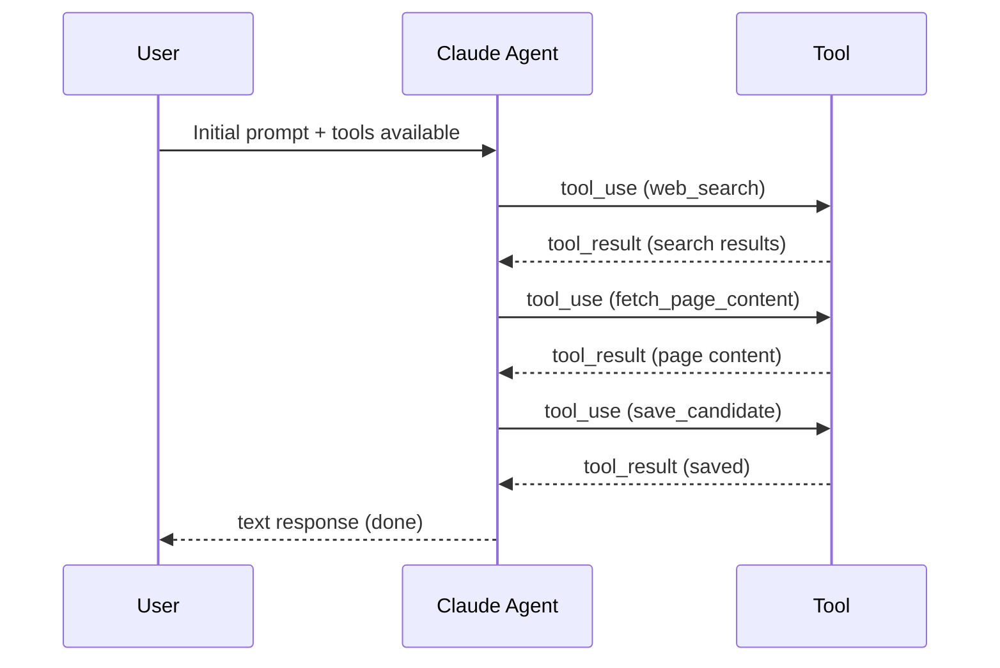
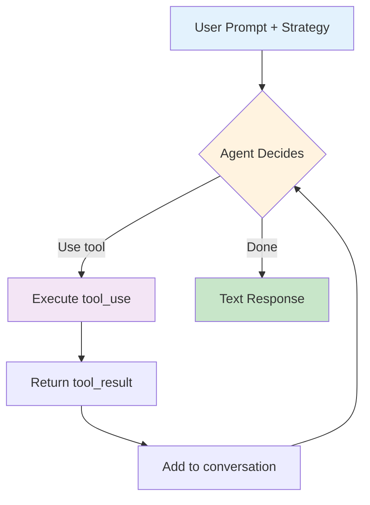
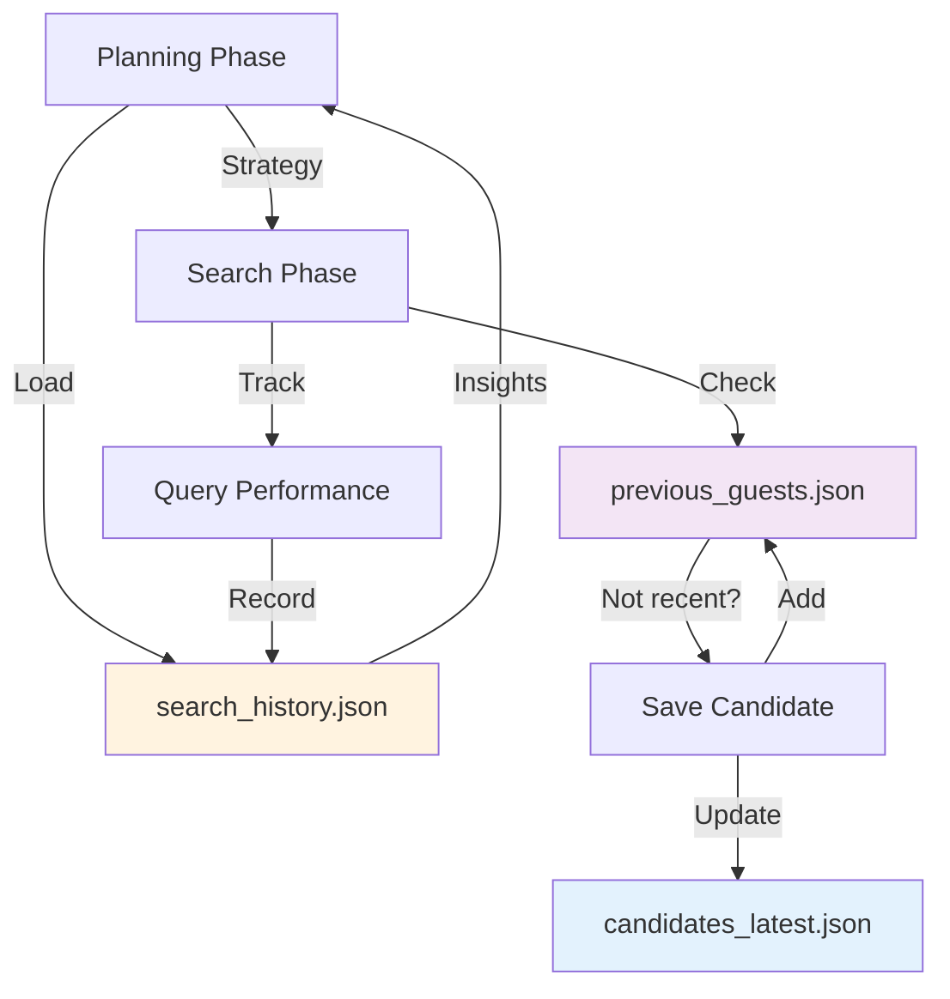

# 🔧 Agent Loop & Tool Calling
## Technical Deep Dive

**Guest Finder Agent Internals**
Understanding the Claude Agentic Loop

---

## Agenda

1. **Agent Loop Architecture** - Multi-turn conversation flow
2. **Tool Calling Mechanism** - How tools are defined and executed
3. **Memory & Learning** - How the agent learns from history

---

# Part 1: Agent Loop Architecture

---

## What is an Agent Loop?

**Definition:**
An agent loop is a conversation cycle where Claude:
1. Receives a message with tools available
2. Decides to use tools or respond with text
3. Receives tool results
4. Continues or stops

**Key Insight:**
The agent autonomously decides when to use tools and when it's done

---

## Multi-Turn Conversation Flow



**Pattern:** Agent chains multiple tool calls autonomously

---

## Stop Reasons: How Loops End

```python
# Inside run_search_phase() - Turn-based loop
while turn_count < max_turns:
    turn_count += 1

    response = self.client.messages.create(
        model=Config.MODEL,
        max_tokens=Config.SEARCH_MAX_TOKENS,
        tools=cast(list[ToolParam], self.tools),
        messages=conversation,
    )

    # Check stop reason
    has_tool_use = False
    for block in response.content:
        if block.type == "tool_use":
            has_tool_use = True
            # Execute tool and add result to conversation

    # Loop ends when agent doesn't use tools
    if not has_tool_use:
        break  # Agent is done!
```

**4 Stop Reasons:**
- `end_turn` - Agent wants to use tools
- `max_tokens` - Hit token limit
- `stop_sequence` - Custom stop sequence
- No tool use - Agent is finished

---

## Conversation Structure

**Messages Array:**
```python
conversation = [
    {
        "role": "user",
        "content": "Search for AI experts in healthcare"
    },
    {
        "role": "assistant",
        "content": [
            {"type": "text", "text": "I'll search for that"},
            {"type": "tool_use", "id": "tool_1", "name": "web_search",
             "input": {"query": "AI healthcare experts Nederland"}}
        ]
    },
    {
        "role": "user",
        "content": [
            {"type": "tool_result", "tool_use_id": "tool_1",
             "content": "{\"results\": [...]}"}
        ]
    },
    # ... more turns ...
]
```

**Pattern:** user → assistant → user → assistant → ...

---

## Guest Finder Agent Loop



**Key Features:**
- Max 10 turns per query (safety limit)
- Silent tool execution (no console spam)
- Automatic conversation building

---

## Real Example: Search Phase Loop

**Turn 1:**
- User: "Execute query: AI healthcare startups Nederland"
- Agent: `tool_use(web_search, query="AI healthcare startups Nederland")`
- User: `tool_result([10 search results])`

**Turn 2:**
- Agent: `tool_use(fetch_page_content, url="https://example.com/startup")`
- User: `tool_result({content: "...", potential_persons: [...]})`

**Turn 3:**
- Agent: `tool_use(check_previous_guests, name="Dr. Sarah Veldman")`
- User: `tool_result({already_recommended: false})`

**Turn 4:**
- Agent: `tool_use(save_candidate, name="Dr. Sarah Veldman", ...)`
- User: `tool_result("✓ Candidate saved")`

**Turn 5:**
- Agent: `text("Found 1 candidate, moving to next query")`
- **Loop ends** (no tool use)

---

## Prompt Caching in Agent Loop

**Problem:** Same ~1500 token instructions repeated 8-12 times

**Solution:** Split prompt into cacheable + dynamic parts

```python
if Config.ENABLE_PROMPT_CACHING:
    conversation.append({
        "role": "user",
        "content": [
            {
                "type": "text",
                "text": SEARCH_EXECUTION_PROMPT_CACHEABLE,  # 1500 tokens
                "cache_control": {"type": "ephemeral"}  # Cache this!
            },
            {
                "type": "text",
                "text": dynamic_prompt  # 200 tokens (status update)
            }
        ]
    })
```

**Impact:**
- Query 1: Creates cache (1500 + 200 = 1700 tokens)
- Query 2-12: Reuses cache (200 tokens each)
- **82% cost reduction!**

---

# Part 2: Tool Calling Mechanism

---

## Tool Definition Structure

```python
def get_tools():
    return [
        {
            "name": "web_search",
            "description": """Zoek op het web naar recente informatie...

            Gebruik voor:
            - Nederlandse AI-experts zoeken
            - Recente persberichten

            Tips voor effectief zoeken:
            - Voeg "Nederland" toe aan queries
            - Gebruik quotes voor exacte zinnen
            """,
            "input_schema": {
                "type": "object",
                "properties": {
                    "query": {
                        "type": "string",
                        "description": "De zoekopdracht"
                    }
                },
                "required": ["query"]
            }
        }
    ]
```

**Key Parts:**
- `name` - Tool identifier
- `description` - Instructions for Claude (critical!)
- `input_schema` - JSON schema for validation

---

## Tool Description Best Practices

**❌ Bad Description:**
```python
"description": "Search the web"
```

**✅ Good Description:**
```python
"description": """Zoek op het web naar recente informatie over AI-experts.

Gebruik voor:
- Nederlandse AI-experts zoeken
- Recente persberichten van universiteiten
- Vakmedia artikelen

Tips voor effectief zoeken:
- Voeg "Nederland" of "Dutch" toe aan queries
- Gebruik quotes voor exacte zinnen: "AI Act implementatie"
- Combineer naam + organisatie voor verificatie
"""
```

**Why it matters:**
- Agent understands WHEN to use the tool
- Agent knows HOW to use it effectively
- Better results = fewer iterations

---

## All 4 Tools in Guest Finder

<div class="columns">

**Search Tools:**
1. **web_search**
   - Multi-provider fallback
   - Returns snippets + URLs
   - Caching enabled

2. **fetch_page_content**
   - Full HTML fetch
   - Auto name extraction
   - Returns persons + context

</div>

<div class="columns">

**Data Tools:**
3. **check_previous_guests**
   - 8-week deduplication
   - Returns recommendation date
   - Prevents duplicates

4. **save_candidate**
   - Validates 2+ sources
   - Saves to JSON
   - Returns confirmation

</div>

---

## Tool Execution Flow

```python
def _handle_tool_call(self, tool_name: str, tool_input: dict, silent: bool = False):
    """Execute a tool and return result"""

    if tool_name == "web_search":
        query = tool_input["query"]
        search_result = self.smart_search.search(query, num_results=10)

        if search_result.get("results"):
            return {
                "results": [
                    {
                        "title": r.get("title", ""),
                        "snippet": r.get("snippet", ""),
                        "url": r.get("link", "")
                    }
                    for r in search_result["results"]
                ],
                "provider": search_result.get("provider", "unknown")
            }

    elif tool_name == "save_candidate":
        # Validate and save candidate
        self.candidates.append({
            "name": tool_input["name"],
            "role": tool_input["role"],
            # ... more fields
            "date": datetime.now().isoformat()
        })
        return f"✓ Candidate '{tool_input['name']}' saved"

    # ... other tools
```

---

## Tool Result Format

**Simple String:**
```python
return "✓ Candidate 'Dr. Sarah Veldman' saved"
```

**Structured Data:**
```python
return {
    "url": "https://example.com",
    "content": "Full page text...",
    "potential_persons": [
        {"name": "Dr. Sarah Veldman", "context": "..."}
    ],
    "persons_found": 3,
    "status": "success"
}
```

**Error Handling:**
```python
return {
    "url": url,
    "error": "HTTP 404",
    "status": "error"
}
```

**Agent sees this as:**
```json
{"type": "tool_result", "tool_use_id": "...", "content": "{...}"}
```

---

## fetch_page_content: Advanced Tool

**Smart Name Extraction:**

```python
# Pattern 1: Titles (Prof., Dr., Drs., Ir.)
title_patterns = [
    r"(Prof\.?\s+(?:dr\.?\s+)?([A-Z][a-z]+(?:\s+[A-Z][a-z]+)+))",
    r"(Dr\.?\s+([A-Z][a-z]+(?:\s+[A-Z][a-z]+)+))",
]

# Pattern 2: Roles
role_patterns = [
    r"([A-Z][a-z]+(?:\s+[A-Z][a-z]+)+),?\s+(hoogleraar|CEO|directeur)",
    r"volgens\s+([A-Z][a-z]+(?:\s+[A-Z][a-z]+)+)",
    r"zegt\s+([A-Z][a-z]+(?:\s+[A-Z][a-z]+)+)",
]

# Extract with context (150 chars)
for match in matches:
    name = match.group(2)
    start = max(0, match.start() - 50)
    end = min(len(text), match.end() + 100)
    context = text[start:end]

    potential_persons.append({
        "name": name,
        "context": context,
        "title_match": match.group(1)  # Optional
    })
```

---

## Multi-Provider Search Tool

```python
class SmartSearchTool:
    def search(self, query: str, num_results: int = 10):
        # Try providers in order
        for provider in self.providers:
            if provider in self.rate_limited_providers:
                continue  # Skip rate-limited

            try:
                result = self._search_with_provider(provider, query)
                return result
            except RateLimitError:
                self.rate_limited_providers.add(provider)
                continue
            except Exception as e:
                continue

        raise Exception("All providers failed")
```

**Features:**
- Automatic fallback: Serper → SearXNG → Brave → Google
- Session-based rate limit tracking
- 1-day result caching
- Seamless for the agent

---

# Part 3: Memory & Learning

---

## Learning System Overview

**What the agent remembers:**
1. **Search History** - All queries with performance metrics
2. **Previous Guests** - 8-week deduplication database
3. **Successful Strategies** - What worked in past sessions

**Storage:**
- `data/search_history.json` - Query performance
- `data/previous_guests.json` - Guest tracking
- `data/candidates_latest.json` - Latest results

---

## Search History Structure

```json
{
  "sessions": [
    {
      "date": "2025-10-15T14:30:00",
      "week_focus": "AI Act implementatie en HR impact",
      "sectors_to_prioritize": ["overheid", "zorg", "HR"],
      "candidates_found": 8,
      "queries": [
        {
          "query": "AI Act implementatie Nederland 2025",
          "rationale": "Focus op praktische implementatie",
          "priority": "high",
          "candidates_found": 3,
          "successful_sources": [
            "https://aic4nl.nl/evenement/...",
            "https://www.werf-en.nl/event/..."
          ],
          "timestamp": "2025-10-15T14:32:15"
        }
      ]
    }
  ]
}
```

**Tracked per query:**
- Query text & rationale
- Candidates found
- Successful URLs
- Timestamp

---

## Learning Insights Generation

```python
def _get_learning_insights(self, weeks: int = 4):
    """Analyze last 4 weeks of search history"""

    recent_sessions = [s for s in self.search_history["sessions"]
                       if date_within_weeks(s["date"], weeks)]

    if not recent_sessions:
        return None

    # Collect all queries
    all_queries = []
    for session in recent_sessions:
        all_queries.extend(session.get("queries", []))

    # Find top performers
    successful_queries = [q for q in all_queries
                          if q.get("candidates_found", 0) > 0]
    successful_queries.sort(
        key=lambda x: x.get("candidates_found", 0),
        reverse=True
    )

    # Analyze sources
    source_stats = {}
    for query in successful_queries:
        for source in query.get("successful_sources", []):
            domain = extract_domain(source)
            source_stats[domain] = source_stats.get(domain, 0) + 1

    top_sources = sorted(source_stats.items(),
                         key=lambda x: x[1], reverse=True)

    return {
        "top_performing_queries": successful_queries[:5],
        "top_sources": [s[0] for s in top_sources[:5]],
        "avg_candidates_per_query": avg(...)
    }
```

---

## Learning in Planning Phase

```python
def run_planning_phase(self):
    # Get learning insights from last 4 weeks
    learning_insights = self._get_learning_insights(weeks=4)

    if learning_insights:
        learning_section = """
## 🎓 Leergeschiedenis

**Succesvol gebleken queries** (vonden meeste kandidaten):
1. "AI Act implementatie experts Nederland" → 3 kandidaten
2. "Nederlandse AI healthcare startups 2025" → 2 kandidaten

**Meest productieve bronnen:**
- aic4nl.nl
- werf-en.nl
- computable.nl

**Gemiddeld**: 1.2 kandidaten per query

⚠️ **Recent gebruikte bronnen** (laatste week):
Deze bronnen zijn recent gebruikt. Personen hiervan vallen
mogelijk binnen de 8-weken exclusie.

**Zoek bij voorkeur naar NIEUWE bronnen** om duplicaten te voorkomen.
"""

    # Add to planning prompt
    prompt = PLANNING_PROMPT.format(
        learning_section=learning_section
    )
```

**Agent uses this to:**
- Avoid recently used sources
- Replicate successful query patterns
- Adjust strategy based on performance

---

## Session Recording

```python
def run_full_cycle(self):
    # ... planning phase
    strategy = self.run_planning_phase()

    # Save strategy for this session
    self.current_session_strategy = {
        "week_focus": strategy.get("week_focus", ""),
        "sectors_to_prioritize": strategy.get("sectors_to_prioritize", []),
        "total_queries_planned": len(strategy.get("search_queries", []))
    }

    # ... search phase
    self.run_search_phase(strategy)

    # After search: Record session
    session_record = {
        "date": datetime.now().isoformat(),
        **self.current_session_strategy,
        "candidates_found": len(self.candidates),
        "queries": self.current_session_queries  # Tracked during search
    }

    self.search_history["sessions"].append(session_record)
    self._save_search_history()
```

**Result:** Each session contributes to learning database

---

## Previous Guests Deduplication

```python
def _handle_tool_call(self, tool_name, tool_input):
    if tool_name == "check_previous_guests":
        name = tool_input["name"]
        cutoff_date = datetime.now() - timedelta(weeks=8)

        for guest in self.previous_guests:
            if guest["name"].lower() == name.lower():
                guest_date = datetime.fromisoformat(guest["date"])

                if guest_date >= cutoff_date:
                    return {
                        "already_recommended": True,
                        "date": guest["date"],
                        "weeks_ago": calculate_weeks(guest_date)
                    }

        return {"already_recommended": False}
```

**Agent Decision:**
- If `already_recommended: true` → Skip candidate
- If `already_recommended: false` → Proceed to save

---

## Memory Flow Diagram



**3 Memory Stores:**
1. **search_history.json** - Learning from past searches
2. **previous_guests.json** - Deduplication (8 weeks)
3. **candidates_latest.json** - Current session results

---

## Learning Reflection

**Low Performance Detection:**

```python
if learning_insights["avg_candidates_per_query"] < 1.0:
    learning_section += """
⚠️ **KRITISCH**: Gemiddeld <1 kandidaat per query.
Vorige strategieën werkten niet. Overweeg:

- Andere query types (niet alleen site:)
- Bredere bronnen (niet alleen vakmedia)
- Andere zoektermen (meer Nederlands, minder technisch)
"""
```

**Agent sees this warning and adjusts strategy!**

**Previous Strategies:**
```python
for strat in learning_insights["previous_strategies"][:3]:
    focus = strat.get("week_focus", "")
    candidates = strat.get("candidates_found", 0)
    learning_section += f'- "{focus}" → {candidates} kandidaten\n'
```

Agent learns: "This focus area worked well" or "This didn't work, try differently"

---

## Learning Impact: Real Example

**Week 1 (No History):**
```
Planning output:
- "AI experts Nederland" → Generic search
- "AI bedrijven Amsterdam" → Location-based
```
Result: 3 candidates found

**Week 2 (With History):**
```
Learning insights show:
- Top query: "AI Act implementatie congres" → 5 candidates
- Top source: aic4nl.nl (congres programma's)

Planning output:
- "AI governance conferenties Nederland november 2025"
- "Nederlandse AI ethics symposium sprekers"
```
Result: 8 candidates found 🎯

**Agent learned:** Conference programs are goldmines!

---

## Memory Persistence

**File Operations:**

```python
def _load_search_history(self):
    try:
        with open("data/search_history.json", encoding="utf-8") as f:
            return json.load(f)
    except FileNotFoundError:
        return {"sessions": []}

def _save_search_history(self):
    os.makedirs("data", exist_ok=True)
    with open("data/search_history.json", "w", encoding="utf-8") as f:
        json.dump(self.search_history, f, indent=2, ensure_ascii=False)
```

**Called:**
- Load: At agent initialization
- Save: After each full cycle completes

**Ensures:** Learning persists across sessions

---

## Key Takeaways

**Agent Loop:**
- Multi-turn conversations enable autonomous tool chaining
- Stop reasons determine when loops end
- Prompt caching reduces costs by 82%

**Tool Calling:**
- Rich descriptions guide agent behavior
- Structured input schemas validate calls
- Tool results can be simple or complex

**Memory & Learning:**
- Search history tracks query performance
- Previous guests enable 8-week deduplication
- Learning insights improve strategy over time

**Result:** An agent that gets smarter with each search!

---

## Advanced Patterns

**Pattern 1: Tool Chaining**
```
web_search → fetch_page_content → check_previous_guests → save_candidate
```
Agent autonomously chains 4 tools per candidate

**Pattern 2: Parallel Tool Use**
```python
# Agent can request multiple tools in one turn:
[
    {"type": "tool_use", "name": "fetch_page_content", "input": {"url": "..."}},
    {"type": "tool_use", "name": "fetch_page_content", "input": {"url": "..."}}
]
```

**Pattern 3: Conditional Tool Use**
```
if check_previous_guests.already_recommended == false:
    save_candidate(...)
else:
    skip and continue
```

---

## Debugging Tools

**Environment Variable:**
```bash
export DEBUG_TOOLS=1
python guest_search.py
```

**Debug Output:**
```
Turn 1, Stop: end_turn
🔧 Tool: web_search
   → Results: 10

Turn 2, Stop: end_turn
🔧 Tool: fetch_page_content
   → Status: success, Persons: 3

Turn 3, Stop: end_turn
🔧 Tool: save_candidate
   → Saved: Dr. Sarah Veldman

Turn 4, Stop: max_tokens
✓ Agent finished (no more tools)
```

**Shows:**
- Turn count and stop reasons
- Tool calls and results
- Agent decision flow

---

## Performance Metrics

**Typical Search Phase:**
- **Queries executed:** 8-12
- **Tool calls per query:** 5-8
- **Total turns:** 40-96
- **Candidates found:** 5-10
- **Duration:** 2-4 minutes

**Cost Breakdown:**
- Without caching: ~18,000 tokens = $0.054
- With caching: ~3,000 tokens = $0.006
- **Savings: 82%** ✅

**Token Usage:**
- Cacheable prompt: 1,500 tokens (cached after first query)
- Dynamic prompt: 200 tokens per query
- Tool results: ~500 tokens per query
- Agent responses: ~300 tokens per query

---

## Code Locations

**Agent Loop:**
- [agent.py:639-749](../../../src/guest_search/agent.py#L639-L749) - `run_search_phase()` multi-turn loop

**Tool Calling:**
- [tools.py:4-114](../../../src/guest_search/tools.py#L4-L114) - Tool definitions
- [agent.py:187-375](../../../src/guest_search/agent.py#L187-L375) - `_handle_tool_call()`

**Memory & Learning:**
- [agent.py:89-103](../../../src/guest_search/agent.py#L89-L103) - Load/save search history
- [agent.py:123-180](../../../src/guest_search/agent.py#L123-L180) - `_get_learning_insights()`
- [agent.py:389-449](../../../src/guest_search/agent.py#L389-L449) - Learning section in planning

---

## Further Reading

**Documentation:**
- 📘 [architecture.md](../../architecture.md) - Arc42 documentation
- 📗 [LEARNING_SYSTEM.md](../../LEARNING_SYSTEM.md) - Learning details
- 📙 [RATE_LIMIT_HANDLING.md](../../RATE_LIMIT_HANDLING.md) - SmartSearch

**Anthropic Docs:**
- [Tool Use Guide](https://docs.anthropic.com/claude/docs/tool-use)
- [Prompt Caching](https://docs.anthropic.com/claude/docs/prompt-caching)

**Code:**
- [src/guest_search/agent.py](../../../src/guest_search/agent.py) - Full agent implementation
- [src/guest_search/tools.py](../../../src/guest_search/tools.py) - Tool definitions

---

# Questions? 💬

**Repository:** https://github.com/Joopsnijder/guest_search

**Key Files:**
- `src/guest_search/agent.py` - Agent loop implementation
- `src/guest_search/tools.py` - Tool definitions
- `data/search_history.json` - Learning database

**Built with:** [Claude Code](https://claude.com/claude-code) by Anthropic

---

# Thank You! 🎉

**Happy Hacking!** 🔧🤖
