# Tool Calling Uitgelegd
## Hoe Claude Sonnet 4 Tools Aanroept

**Guest Search System**
Communicatie tussen Model, Prompts & Tools

---

## Overzicht: Wat is Tool Calling?

**Tool Calling** = LLM kan externe functies aanroepen tijdens conversatie

**In ons systeem:**
- Claude Sonnet 4 = Het brein
- Tools = De handen (web_search, fetch_page_content, etc.)
- `_handle_tool_call()` = De vertaler tussen brein en handen

**Waarom belangrijk:**
- LLM kan geen direct web zoeken
- LLM kan geen files lezen/schrijven
- Tools geven LLM deze mogelijkheden

---

## De Complete Flow

```mermaid
graph TB
    User[👤 User] -->|run_search_phase| Agent[🤖 Agent]
    Agent -->|1. Send prompt + tools| Claude[🧠 Claude Sonnet 4]

    Claude -->|2. Response with tool_use| Agent

    Agent -->|3. Call _handle_tool_call| Tools[🔧 Tools]
    Tools -->|4. Execute & return result| Agent

    Agent -->|5. Send tool_result| Claude
    Claude -->|6. Process & continue| Agent

    Agent -->|7. Final response| User

    style Claude fill:#e3f2fd
    style Tools fill:#fff3e0
    style Agent fill:#f3e5f5
```



---

## Stap 1: Agent Stuurt Prompt + Tools

**Code:**
```python
response = self.client.messages.create(
    model="claude-sonnet-4-20250514",
    max_tokens=8000,
    tools=self.tools,  # ← Tool definities
    messages=conversation  # ← Conversatie geschiedenis
)
```

**Wat gebeurt er:**
1. Agent roept Claude API aan
2. Stuurt prompt: "Zoek AI experts in Nederland"
3. Stuurt tool definities mee (JSON schema)

---

<!-- _class: compact -->

## Tool Definities

<div class="columns">

<div>

**JSON Schema:**

```python
{
  "name": "web_search",
  "description": "Search web",
  "input_schema": {
    "type": "object",
    "properties": {
      "query": {
        "type": "string",
        "description": "Query"
      }
    },
    "required": ["query"]
  }
}
```

</div>

<div>

**Claude leert:**
- ✅ Tool naam
- ✅ Wat tool doet
- ✅ Welke parameters
- ✅ Welke verplicht

**Gebruikt voor:**
- Parameter validatie
- Auto-completion
- Tool selection

</div>

</div>

---

## Stap 2: Claude Beslist Tool Te Gebruiken

**Claude's response:**
```json
{
  "content": [
    {
      "type": "text",
      "text": "Ik ga zoeken naar AI experts in Nederland..."
    },
    {
      "type": "tool_use",
      "id": "toolu_01ABC123",
      "name": "web_search",
      "input": {
        "query": "AI experts Nederland 2025"
      }
    }
  ]
}
```

**Belangrijk:**
- Claude beslist zelf om tool te gebruiken
- Genereert de juiste parameters
- Geeft tool_use_id voor tracking

---

## Stap 3: Agent Detecteert Tool Call

**Code in `run_search_phase()`:**

```python
for block in response.content:
    if block.type == "text":
        # Gewone tekst van Claude
        assistant_message["content"].append(block)

    elif block.type == "tool_use":
        # 🎯 Claude wil een tool gebruiken!
        result = self._handle_tool_call(
            block.name,    # "web_search"
            block.input,   # {"query": "..."}
            silent=True
        )
```

**Wat gebeurt:**
1. Loop door alle content blocks
2. Detecteer `tool_use` type
3. Roep `_handle_tool_call()` aan

---

<!-- _class: compact -->

## Stap 4: _handle_tool_call() Voert Tool Uit

**De vertaler functie:**

```python
def _handle_tool_call(self, tool_name, tool_input, silent=False):
    """Verwerk tool calls van de agent"""

    if tool_name == "web_search":
        query = tool_input["query"]

        # Gebruik SmartSearchTool
        search_result = self.smart_search.search(
            query,
            num_results=10
        )

        # Format resultaten voor Claude
        return {
            "results": [
                {
                    "title": r.get("title", ""),
                    "snippet": r.get("snippet", ""),
                    "url": r.get("link", "")
                }
                for r in search_result["results"]
            ],
            "provider": search_result.get("provider")
        }
```

---

## _handle_tool_call: Alle Tools

<div class="columns">

<div>

**1. web_search**
- Roept SmartSearchTool aan
- Multi-provider fallback
- Returns: lijst met results

**2. fetch_page_content**
- Haalt HTML op met requests
- Parse met BeautifulSoup
- Returns: schone tekst (max 4000 chars)

</div>

<div>

**3. check_previous_guests**
- Checkt previous_guests.json
- Berekent weeks_ago
- Returns: duplicate info

**4. save_candidate**
- Voegt toe aan self.candidates
- Returns: totaal aantal

</div>

</div>

**Pattern:** Elke tool heeft eigen logica, maar zelfde interface

---

## Stap 5: Tool Result Terug Naar Claude

**Code:**
```python
# Voeg tool_use toe aan conversatie
assistant_message["content"].append(block)
conversation.append(assistant_message)

# Voeg tool_result toe
conversation.append({
    "role": "user",
    "content": [{
        "type": "tool_result",
        "tool_use_id": block.id,
        "content": json.dumps(result)
    }]
})
```

**Conversatie wordt:**
```
Assistant: Ik ga zoeken... [tool_use: web_search]
User: [tool_result: {"results": [...]}]
```

---

## Stap 6: Claude Verwerkt Result

**Claude ontvangt:**
```json
{
  "type": "tool_result",
  "tool_use_id": "toolu_01ABC123",
  "content": "{\"results\": [{\"title\": \"...\", ...}]}"
}
```

**Claude kan nu:**
1. Resultaten analyseren
2. Beslissen: meer tools nodig?
3. Of: antwoord geven aan user

**Dit heet "agentic loop"**

---

## De Agentic Loop


**Voorbeeld sequence:**
1. Claude: "Ik zoek eerst op Google" → tool_use
2. Result: 10 URLs gevonden
3. Claude: "Ik fetch de eerste URL" → tool_use
4. Result: HTML content
5. Claude: "Ik heb genoeg info" → text response

---

<!-- _class: compact -->

## Real Example: Een Complete Cyclus

**1. User prompt:**
"Zoek Nederlandse AI experts"

**2. Claude's eerste response:**
```json
{
  "type": "tool_use",
  "name": "web_search",
  "input": {"query": "Nederlandse AI experts 2025"}
}
```

**3. Tool result:**
```json
{
  "results": [
    {"title": "Dr. Sarah AI Expert", "url": "https://..."}
  ]
}
```

**4. Claude's tweede response:**
```json
{
  "type": "tool_use",
  "name": "fetch_page_content",
  "input": {"url": "https://..."}
}
```

---

<!-- _class: compact -->

## Real Example (vervolg)

**5. Tool result:**
```json
{
  "content": "Dr. Sarah Veldman is AI researcher at TNO..."
}
```

**6. Claude's derde response:**
```json
{
  "type": "tool_use",
  "name": "check_previous_guests",
  "input": {"name": "Dr. Sarah Veldman"}
}
```

**7. Tool result:**
```json
{
  "already_recommended": false
}
```

**8. Claude's finale response:**
```json
{
  "type": "tool_use",
  "name": "save_candidate",
  "input": {
    "name": "Dr. Sarah Veldman",
    "organization": "TNO",
    "role": "AI Researcher"
  }
}
```

---

## Conversatie Geschiedenis

**Waarom important?**
- Claude moet context bewaren
- Volgende tool call gebruikt eerdere results
- Staat in `conversation` list

**Structuur:**
```python
conversation = [
    {"role": "user", "content": "Zoek AI experts"},
    {"role": "assistant", "content": [tool_use_1]},
    {"role": "user", "content": [tool_result_1]},
    {"role": "assistant", "content": [tool_use_2]},
    {"role": "user", "content": [tool_result_2]},
    # etc...
]
```

**Bij elke API call:** hele conversatie mee gestuurd

---

## Silent Mode vs Verbose

**In onze code:**
```python
result = self._handle_tool_call(
    block.name,
    block.input,
    silent=True  # ← Geen print statements
)
```

**Waarom silent?**
- Zoek fase: veel tool calls (10-50x)
- Terminal zou vol staan met logs
- Progress bar is genoeg feedback

**Alternatief:** verbose mode voor debugging

---

## Error Handling in Tools

**Voorbeeld: fetch_page_content**
```python
try:
    response = requests.get(url, timeout=10)
    if response.status_code == 200:
        # Parse en return content
        return {"content": text, "status": "success"}
    else:
        return {"error": f"HTTP {response.status_code}",
                "status": "error"}
except Exception as e:
    return {"error": str(e), "status": "error"}
```

**Claude krijgt error info:**
- Kan beslissen: skip deze URL
- Of: probeer andere tool
- Error = gewoon een tool result

---

## Waarom Deze Architectuur?

**Voordelen:**

<div class="columns">

<div>

**Voor LLM:**
- Blijft stateless
- Geen side effects
- Deterministisch

**Voor Code:**
- Tools zijn testbaar
- Easy te debuggen
- Modulair design

</div>

<div>

**Voor Ons:**
- Control over wat LLM kan
- Rate limiting mogelijk
- Caching per tool
- Cost tracking

**Flexibiliteit:**
- Nieuwe tools = easy
- Tools kunnen complex zijn
- Tools kunnen andere tools callen

</div>

</div>

---

## Tool Chain Example

**Scenario:** Guest zoeken met LinkedIn


**Elke tool:**
- Voegt info toe
- Valideert data
- Bereidt voor voor volgende stap

**Claude orchestreert de chain**

---

<!-- _class: compact -->

## Code Flow Diagram


---

## Performance Optimizations

**In ons systeem:**

**1. Silent mode tijdens loops**
```python
result = self._handle_tool_call(..., silent=True)
```

**2. Caching in SmartSearchTool**
- 1-day cache voor search results
- Scheelt API calls & kosten

**3. Content truncation**
```python
if len(text) > 4000:
    text = text[:4000] + "\n\n[...truncated...]"
```

**4. Progress tracking**
- Rich Progress bar
- User ziet vooruitgang
- Geen spammy logs

---

## Testing _handle_tool_call

**Unit test voorbeeld:**
```python
def test_web_search_tool():
    agent = GuestFinderAgent()

    result = agent._handle_tool_call(
        tool_name="web_search",
        tool_input={"query": "test query"}
    )

    assert "results" in result
    assert isinstance(result["results"], list)
    assert "provider" in result
```

**Elke tool heeft:**
- Unit tests (gemockt)
- Integration tests (real API)
- Error scenario tests

---

## Extending: Nieuwe Tool Toevoegen

**Stap 1: Definieer tool**
```python
{
    "name": "find_email",
    "description": "Find email address for a person",
    "input_schema": {
        "type": "object",
        "properties": {
            "name": {"type": "string"},
            "company": {"type": "string"}
        },
        "required": ["name", "company"]
    }
}
```

**Stap 2: Implementeer in _handle_tool_call**
```python
elif tool_name == "find_email":
    name = tool_input["name"]
    company = tool_input["company"]
    # ... email finding logic
    return {"email": email, "confidence": 0.8}
```

---

## Best Practices

**Do's:**
- ✅ Return consistent JSON format
- ✅ Handle errors gracefully
- ✅ Validate input parameters
- ✅ Log voor debugging (optioneel)
- ✅ Timeout voor externe calls
- ✅ Cache waar mogelijk

**Don'ts:**
- ❌ Raise exceptions (return errors)
- ❌ Side effects zonder return
- ❌ Blocking calls zonder timeout
- ❌ Geen print in production
- ❌ Sensitive data in logs

---

## Common Pitfalls

**1. Vergeten tool_result terug te sturen**
```python
# ❌ Wrong
assistant_message["content"].append(block)
conversation.append(assistant_message)
# Claude wacht op result!

# ✅ Correct
conversation.append({
    "role": "user",
    "content": [{"type": "tool_result", ...}]
})
```

**2. JSON serialization errors**
```python
# ✅ Always use json.dumps()
"content": json.dumps(result)
```

---

## Debugging Tips

**1. Print conversatie geschiedenis**
```python
for msg in conversation:
    print(f"{msg['role']}: {msg['content']}")
```

**2. Log tool calls**
```python
def _handle_tool_call(self, tool_name, tool_input, silent=False):
    if not silent:
        print(f"🔧 Tool: {tool_name}")
        print(f"📥 Input: {tool_input}")

    result = # ... tool logic

    if not silent:
        print(f"📤 Output: {result}")

    return result
```

**3. Use Anthropic's workbench**
- Test prompts online
- See tool calls visually
- Debug zonder code

---

## Advanced: Thinking Budget

**Claude Sonnet 4 heeft "thinking":**
```python
response = self.client.messages.create(
    model=Config.MODEL,
    thinking={
        "type": "enabled",
        "budget_tokens": 2000  # ← Extended reasoning
    },
    messages=[...]
)
```

**Wat doet dit:**
- Claude krijgt "scratchpad" voor redeneren
- Niet zichtbaar in output
- Betere tool decisions
- Gebruikt in planning fase

---

## Comparison: Met vs Zonder Tools

<div class="columns">

<div>

**Zonder Tools:**
```
User: Zoek AI experts

Claude: Ik kan niet zoeken.
Ik heb geen toegang tot
internet. Ik kan alleen
algemene info geven over
AI experts.
```

</div>

<div>

**Met Tools:**
```
User: Zoek AI experts

Claude: [calls web_search]
Claude: [calls fetch_page]
Claude: [calls save_candidate]

Claude: Ik heb 5 experts
gevonden: Dr. Sarah van TNO,
Prof. Jan van TU Delft, ...
```

</div>

</div>

**Tools = Superpowers voor LLM** 🦸

---

## Real World Metrics

**Ons Guest Search systeem:**

- **Tools per search:** ~15-30 calls
- **Search phase:** ~50 tool calls totaal
- **Success rate:** ~95% (5% errors)
- **Average latency:** ~2s per tool
- **Tokens per tool result:** ~500-1000

**Cost implication:**
- Without tools: ~$0.10 (prompt only)
- With tools: ~$0.40 (prompt + results)
- **Value:** Automated guest finding! 🎯

---

## Summary: Key Takeaways

**1. Tool Calling = LLM + External Functions**

**2. Flow:**
   User → Agent → Claude → tool_use → _handle_tool_call → tool_result → Claude

**3. _handle_tool_call:**
   - Central dispatcher
   - Maps tool names to implementations
   - Returns standardized JSON

**4. Conversatie geschiedenis cruciaal:**
   - Context voor volgende calls
   - Claude ziet alle tool results

**5. Error handling = tool results:**
   - Claude kan errors verwerken
   - Geen crashes, graceful degradation

---

## Resources

**Documentation:**
- Anthropic Tool Use docs: https://docs.anthropic.com/en/docs/tool-use
- Code: `src/guest_search/agent.py`
- Tests: `tests/test_agent.py`

**In dit project:**
- Tool definities: `src/guest_search/tools.py`
- SmartSearchTool: `src/utils/smart_search_tool.py`
- Prompts: `src/guest_search/prompts.py`

**Experimenteren:**
- Anthropic Workbench
- Claude Code (deze tool!)

---

# Vragen? 💬

**Belangrijkste concepten:**
1. Claude beslist wanneer tools te gebruiken
2. `_handle_tool_call()` voert tools uit
3. Tool results gaan terug naar Claude
4. Agentic loop: Claude kan meerdere tools chainen

**Volgende stap:** Probeer zelf een tool toe te voegen!

---

# Demo Time! 🎬

**Live demonstratie:**

1. Run agent met verbose logging
2. Zie tool calls in real-time
3. Inspect conversatie geschiedenis
4. Debug een tool failure

`python main.py` met debug mode

---

# Thank You! 🎉

**Happy Tool Calling!** 🔧🤖
