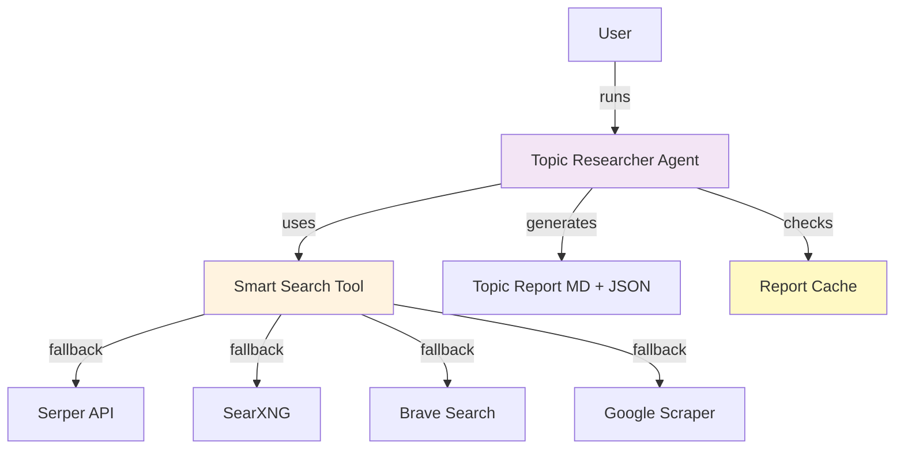
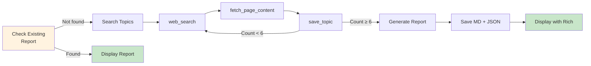
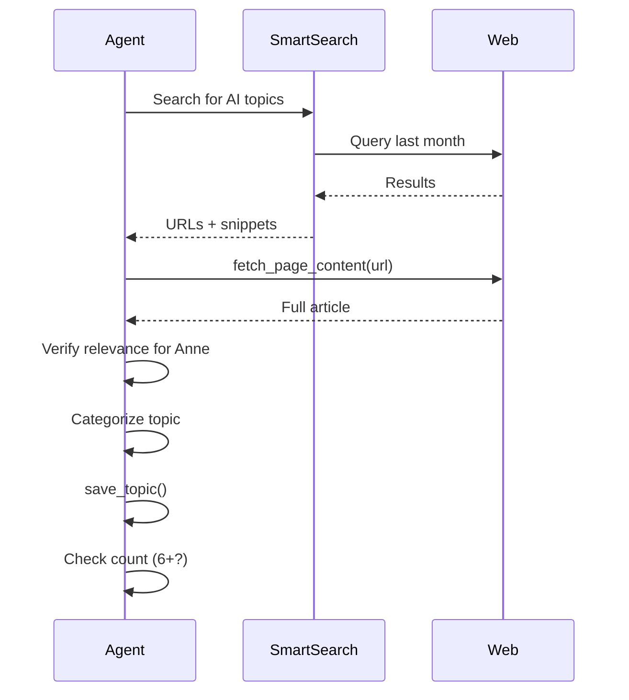
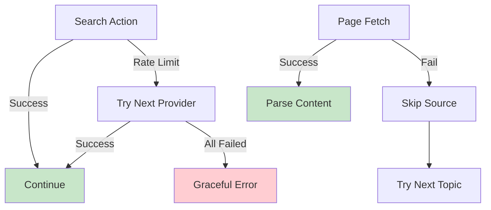

# 📊 Topic Researcher Agent
## AI-Powered Podcast Topic Discovery

**AIToday Live Podcast**
Intelligent Content Discovery System

---

## What is the Topic Researcher Agent?

**Purpose:**
Discover 6-8 interesting AI topics for weekly podcast episodes

**Powered by:**
- Claude Sonnet 4 with extended thinking
- Multi-provider web search
- Smart caching system

**Output:**
- Diverse topic mix across 6 categories
- Actionable discussion angles
- Keywords for guest search integration

---

## System Architecture



---

## Target Persona: Anne de Vries

**Who is Anne?**

👤 **IT Product Owner**
- Works at mid-size Dutch company
- Manages product development team
- Tech-savvy but not AI specialist

**Characteristics:**
- 🚀 Early adopter
- 📚 Knows basic AI concepts
- 💼 Wants practical applications
- 🤔 Critical thinker
- ⚠️ Wants to know what works AND what doesn't

**Content Preference:** Actionable insights over pure theory

---

## Six Topic Categories

**Ensuring Diverse Content:**

<div class="columns">

**1. 🔬 Wetenschappelijk**
- Research breakthroughs
- Academic papers
- Practical implications

**2. 💼 Praktijkvoorbeeld**
- Dutch organizations using AI
- Real-world implementations
- Success stories & failures

**3. 📚 Informatief**
- AI concept explanations
- Technology deep-dives
- How things work

</div>

<div class="columns">

**4. 🔄 Transformatie**
- Industries being transformed
- Disruption patterns
- Future of work

**5. ⚠️ Waarschuwend**
- Risks & failures
- Ethical dilemmas
- What can go wrong

**6. 🚀 Kans**
- New opportunities
- Tools to try
- Emerging possibilities

</div>

---

## Topic Search Criteria

**What Makes a Good Topic:**

**Time Range:**
- ✅ Last **month** (not just 2 weeks)
- ✅ Recent enough to be relevant
- ✅ Not too old to be outdated

**Quality Criteria:**
- Must be interesting for Anne (practical focus)
- Should enable 20-30 minute discussion
- Needs Dutch angle when possible
- Multiple source verification (min 2)

**Diversity:**
- Mix of all 6 categories
- Balance between technical & practical
- Include both opportunities & warnings

---

## How It Works: Search Flow



**Smart Caching:** Checks for today's report before searching

---

## Search Process

**Step-by-Step:**



**Goal:** Find 6-8 high-quality diverse topics

---

<!-- _class: compact -->

## Report Content Structure

<div class="columns">

**Basic Info:**
- Title (max 60 chars)
- Category (1 of 6)
- Description (2-3 sentences)

**For Anne:**
- Why relevant for her
- Practical angle

</div>

<div class="columns">

**For Production:**
- **Keywords** → Guest Finder
- Discussion angles (3-4)
- Sources (min 2, prefer NL)

**Removed:**
- ~~Ideal guest profile~~

</div>

---

## Report Example

```markdown
## RAG Implementatie in de Praktijk
**Categorie:** 💼 Praktijkvoorbeeld

**Waarom relevant:** Product owners kunnen deze techniek
direct toepassen voor betere zoekfunctionaliteit.

**Beschrijving:** RAG combineert zoeken met AI.
Nederlandse bedrijven zien 30% verbetering.

**Keywords:** RAG, retrieval augmented generation,
Nederlandse implementaties, vector databases

**Discussie:**
- Wanneer RAG gebruiken?
- Typische valkuilen?
- Kosten vs traditioneel zoeken?

**Bronnen:** [RAG in Productie](https://...) (5 okt)
[Vector DB](https://...) (12 okt)
```

---

## Duplicate Prevention

**Smart Caching System:**

```
output/topic_reports/
├── week_41_20251012.md      # Today's report
├── week_41_20251012.json    # Structured data
├── week_40_20251005.md      # Last week
└── week_40_20251005.json
```

**Behavior:**
- ✅ Checks for today's report before searching
- ✅ Shows existing report if found (0 API cost!)
- ✅ Option to force new search (overwrites)
- ✅ One report per day maximum

**Benefits:** Saves API costs & prevents duplicate work

---

## Report Display

**Rich Terminal Rendering:**

<div class="columns">

**Features:**
- 📝 Beautiful markdown rendering
- 🎨 Syntax highlighting
- 📋 Formatted headers
- 🔗 Clickable URLs
- ➖ Section dividers
- 📊 Category icons

**User Experience:**
- Easy to scan
- Professional output
- No external viewer needed
- Terminal-native

</div>

```
┏━━━━━━━━━━━━━━━━━━━━━━━━━┓
┃  AI Topics Week 41      ┃
┗━━━━━━━━━━━━━━━━━━━━━━━━━┛

💼 RAG Implementatie
📚 Vector Databases Uitgelegd
⚠️ AI Bias in Recruitment
...
```

---

## Integration with Guest Finder

**Workflow: Topics → Guests**


**Example Integration:**
1. Topic: "RAG implementation in healthcare"
2. Keywords: "RAG, retrieval augmented generation, Dutch healthcare"
3. Guest Search: Finds experts implementing RAG
4. Result: Topic-aligned guests

---

<!-- _class: compact -->

## Configuration

<div class="columns">

<div>

**Environment Variables:**

```bash
# Required
ANTHROPIC_API_KEY=key

# Recommended (≥1)
SERPER_API_KEY=key
BRAVE_API_KEY=key
```

</div>

<div>

**Settings:**
- Time range: Last month
- Target: 6-8 topics
- Sources: Min 2/topic
- Categories: All 6 types

**Note:** No Trello needed

</div>

</div>

---

## Usage

**Run Topic Search:**

```bash
python topic_search.py
```

**What Happens:**

1. ✅ Check for today's report
2. ✅ If exists: Show summary + option to view
3. ✅ If not: Run search (6-8 topics)
4. ✅ Generate report (MD + JSON)
5. ✅ Display with Rich markdown
6. ✅ Save to `output/topic_reports/`

**Daily Workflow:**
- Morning: Run topic search
- Review: Check topics and keywords
- Afternoon: Run guest search with keywords

---

## Output Files

**Directory Structure:**

```
output/
└── topic_reports/
    ├── week_41_20251012.md      # Markdown report
    ├── week_41_20251012.json    # Structured data
    ├── week_40_20251005.md
    └── week_40_20251005.json
```

**File Naming:**
- Format: `week_{week}_{date}.{ext}`
- Example: `week_41_20251012.md`
- Week number from ISO calendar
- Automatically dated

**Encoding:** UTF-8, git-friendly

---

## JSON Output Structure

**Structured Data for Automation:**

```json
{
  "week": 41,
  "year": 2025,
  "date_generated": "2025-10-12T10:30:00",
  "topics": [
    {
      "title": "RAG Implementatie in de Praktijk",
      "category": "Praktijkvoorbeeld",
      "description": "...",
      "why_relevant_for_anne": "...",
      "search_keywords": "RAG, retrieval...",
      "discussion_angles": ["...", "..."],
      "sources": [
        {
          "url": "https://...",
          "title": "...",
          "date": "2025-10-05"
        }
      ]
    }
  ]
}
```

---

<!-- _class: compact -->

## Testing Coverage

**15 Tests - All Passing ✅**

<div class="columns-3">

<div>

**Agent:**
- Initialization
- Tool definitions
- Tool handling
- Report generation
- Error handling

</div>

<div>

**Validation:**
- Category validation
- Topic structure
- Source requirements
- Keyword extraction
- Date parsing

</div>

<div>

**Quality:**
- Unit tests
- Mocked externals
- Fast execution

**Plus:**
- Uses Guest Finder
  infrastructure tests
- Total: 181 tests

</div>

</div>

---

## Performance & Costs

**API Usage per Run:**

<div class="columns">

**Token Breakdown:**
- Search: ~15,000 tokens
  - 6-8 topic searches
  - Page content analysis
- Report: ~3,000 tokens
  - Markdown generation
  - JSON structuring

**Total: ~18,000 tokens/run**

</div>

**Estimated Costs:**
- Claude Sonnet 4: ~$0.30/run
- Search APIs: Free tier sufficient
- **Cached:** $0.00 (same day)
- **Total: ~$0.30 per new topic search**

---

## Error Handling

**Robust Fallback System:**



**Examples:**
- Search fails → Automatic provider fallback
- Page unreachable → Skip source, find another
- Insufficient topics → Continue searching
- API key missing → Clear error message

---

## Daily Workflow

**Recommended Process:**


**Steps:**
1. **09:00** - Run `python topic_search.py`
2. **09:15** - Review 6-8 topics, extract keywords
3. **14:00** - Run `python guest_search.py` with keywords
4. **14:30** - Select guests, export to Trello
5. **Weekly** - Review and clean up Trello board

---

## Best Practices

**Content Guidelines:**

**Do:**
- ✅ Focus on practical applications
- ✅ Include Dutch angle when possible
- ✅ Balance opportunities & warnings
- ✅ Verify multiple sources
- ✅ Extract clear keywords for guest search

**Don't:**
- ❌ Run search twice same day (use cache)
- ❌ Include topics older than 1 month
- ❌ Focus only on one category
- ❌ Use single-source topics
- ❌ Skip Anne's perspective

---

## Tech Stack

<div class="columns">

**Core Technologies:**
- Python 3.10+
- Anthropic Claude Sonnet 4
- Rich (Terminal UI)
- BeautifulSoup4 (HTML)
- Requests (HTTP)

**Search Providers:**
- Serper API
- SearXNG
- Brave Search API
- Google Scraper

</div>

<div class="columns">

**Testing:**
- Pytest (15 tests)
- Unittest.mock
- Pytest-cov

**Tools:**
- Ruff (formatting)
- Mypy (type checking)
- Git (version control)

</div>

---

## Key Features Summary

**What Makes It Special:**

- ✅ **Persona-targeted** - Content for Anne specifically
- ✅ **Six diverse categories** - Balanced content mix
- ✅ **Last month timeframe** - Not just 2 weeks
- ✅ **Smart caching** - One report per day
- ✅ **Rich rendering** - Beautiful terminal output
- ✅ **JSON + MD output** - Machine & human readable
- ✅ **Guest integration** - Keywords for guest search
- ✅ **Cost-effective** - ~$0.30 per search, $0 cached

---

## Future Enhancements

**Potential Features:**

<div class="columns">

**Content:**
- 🎯 Multiple personas (beyond Anne)
- 🌐 Multi-language support
- 📊 Topic trend analysis
- 🔔 Weekly auto-scheduling

**Integration:**
- 📱 Slack/Discord notifications
- 📧 Email digest format
- 🤖 Auto-suggest episode structure
- 📈 Analytics dashboard

</div>

**Contributions welcome!**
Repository: https://github.com/Joopsnijder/guest_search

---

## Documentation

**Available Resources:**

- 📘 [README.md](../../README.md) - Quick start & overview
- 📗 [USAGE.md](../../USAGE.md) - Complete usage guide
- 📙 [RATE_LIMIT_HANDLING.md](../../RATE_LIMIT_HANDLING.md) - Search details
- 📊 [TEST_COVERAGE_SUMMARY.md](../../TEST_COVERAGE_SUMMARY.md) - Test details
- 🏗️ [architecture.md](../../architecture.md) - Arc42 documentation

**All docs:** Maintained and up-to-date

---

## Comparison: Before vs After

**Before (Manual Process):**
- 🕐 2-3 hours browsing news sites
- 🤷 Inconsistent topic diversity
- 😓 Repetitive content patterns
- 📋 Manual note-taking

**After (Topic Researcher Agent):**
- ⚡ 5 minutes automated search
- 🎯 Guaranteed category diversity
- 🔄 Fresh perspectives weekly
- 📊 Structured JSON output
- 💰 Cost: ~$0.30 per week

**Time Saved:** ~2.5 hours per week

---

# Demo Time! 🎬

**Let's see the Topic Researcher in action:**

1. Check for existing report
2. Run new topic search
3. Category diversity
4. Rich markdown display
5. JSON output structure
6. Keyword extraction for guest search

---

# Questions? 💬

**Repository:** https://github.com/Joopsnijder/guest_search

**License:** MIT

**Built with:** [Claude Code](https://claude.com/claude-code) by Anthropic

---

# Thank You! 🎉

**Happy Topic Discovery!** 📊🎙️
