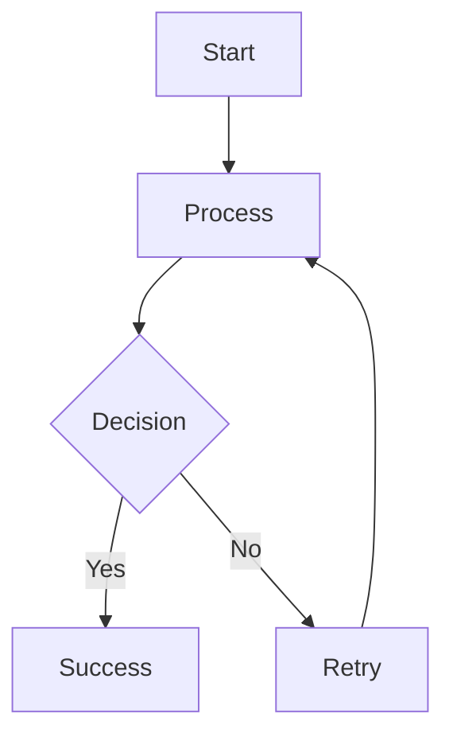

# My Presentation Title
## Subtitle

---

## Introduction

This is a sample slide with a Mermaid diagram.

---

## Diagram Example

---

## Features

- ✅ Mermaid diagrams automatically converted to SVG
- ✅ Responsive scaling
- ✅ Emoji support
- 📊 Easy to maintain

---

## Next Steps

1. Edit this markdown file
2. Add your content and Mermaid diagrams
3. Run `npm run build:presentations docs/your-file.md`
4. Open the generated HTML or PDF

---

# Thank You! 🎉
